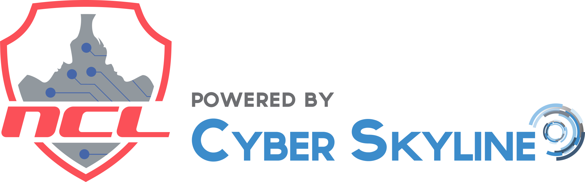

  

  
# 🚀 NCL CyberSkyline @ WiCyS 2026  
## 🔥 Multi-Domain Offensive & Defensive Security Competition

---

## 🎯 Competition Objective

The NCL CyberSkyline competition is a structured, multi-domain cybersecurity challenge designed to test both offensive and defensive skillsets across real-world security scenarios.

This repository will document:

- Structured enumeration workflows  
- Log & network traffic analysis  
- Exploitation methodology  
- Cryptographic reasoning  
- Forensic artifact recovery  
- Cross-domain investigative pivoting  

All documentation will focus on **methodology and analytical reasoning only**.  
No flags or protected answers will be published.

---

# 🧭 Module Overview

This competition spans multiple security disciplines:

---

## 🟢 Getting Started
- Platform orientation
- Terminology alignment
- Workflow familiarization
- Baseline technical calibration

---

## 🌐 Open Source Intelligence (OSINT)
- Public data harvesting  
- Attribution techniques  
- Digital footprint analysis  
- Tool-assisted information discovery  

---

## 🔐 Cryptography
- Cipher classification  
- Encoding vs. encryption identification  
- Manual and tool-assisted decryption  
- Pattern recognition  

---

## 📜 Log Analysis
- Authentication event tracking  
- Suspicious activity reconstruction  
- Timestamp correlation  
- Artifact interpretation  

---

## 📡 Network Traffic Analysis
- PCAP inspection  
- Session reconstruction  
- Protocol behavior analysis  
- Timeline building  

---

## 🔑 Password Cracking
- Hash identification  
- Brute force vs. wordlist methodology  
- Rule-based mutation strategies  
- Efficiency optimization  

---

## 📄 Forensics
- File artifact inspection  
- Metadata analysis  
- Data carving techniques  
- Hidden content discovery  

---

## 🔎 Scanning & Reconnaissance
- Service discovery  
- Port analysis  
- Vulnerability identification  
- Structured enumeration discipline  

---

## 🌍 Web Application Exploitation
- Input validation weaknesses  
- Authentication bypass  
- Authorization flaws  
- Logic-based exploitation  

---

## 💣 Enumeration & Exploitation
- Privilege escalation  
- Misconfiguration abuse  
- Attack chain sequencing  
- Offensive mindset under constraints  

---

# 🧠 Documentation Strategy

Each challenge will follow a standardized documentation model:

1. Objective  
2. Environment & Tools  
3. Initial Hypothesis  
4. Investigation Workflow  
5. Analytical Pivots  
6. Outcome Summary  
7. Defensive Implications  
8. Lessons Learned  

This ensures consistency across all modules and enables cross-domain skill correlation.

---

# 🎯 Strategic Focus Areas (Personal Goals)

For this competition, emphasis will be placed on:

- 📊 Advanced log correlation  
- 📡 Timeline-based PCAP reconstruction  
- 🪟 Windows event deep dives  
- 🔐 Cryptographic misclassification avoidance  
- 🧭 Faster structured enumeration  
- 🧠 Reducing pivot hesitation  

---

## 👤 Shannon “Shae” Smith  
Cybersecurity | DFIR • Web • Detection Engineering  
U.S. Navy Veteran | Virginia Tech — M.S. Information Technology  

🚀 Compete. Analyze. Document. Improve.  

