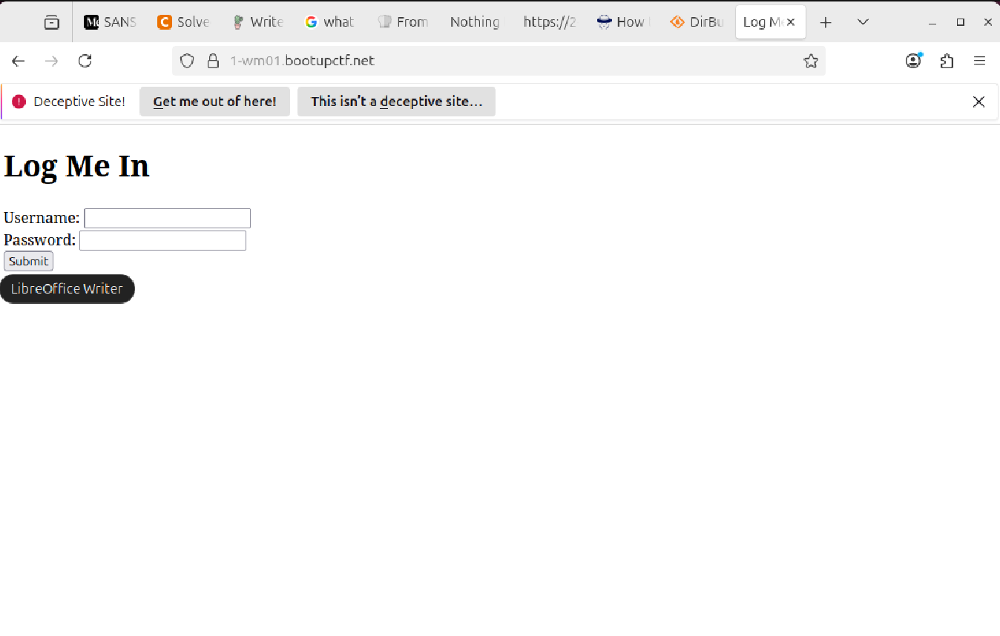
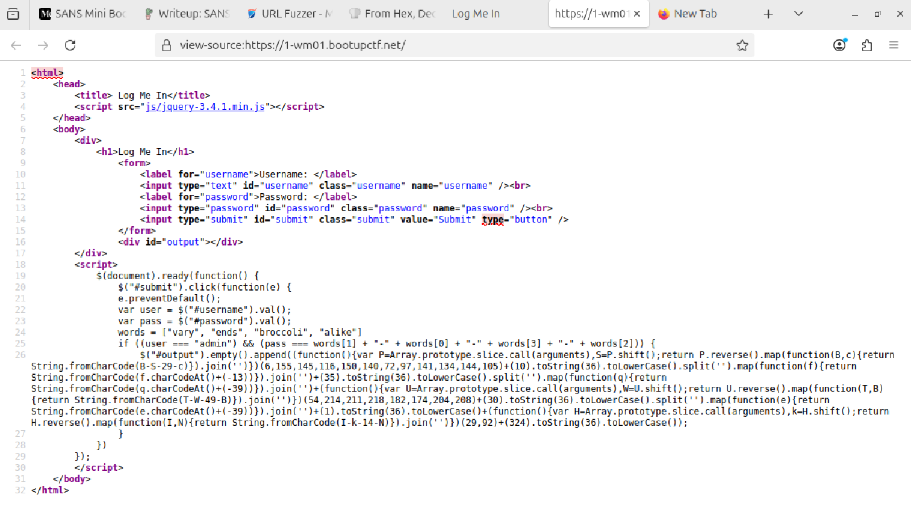
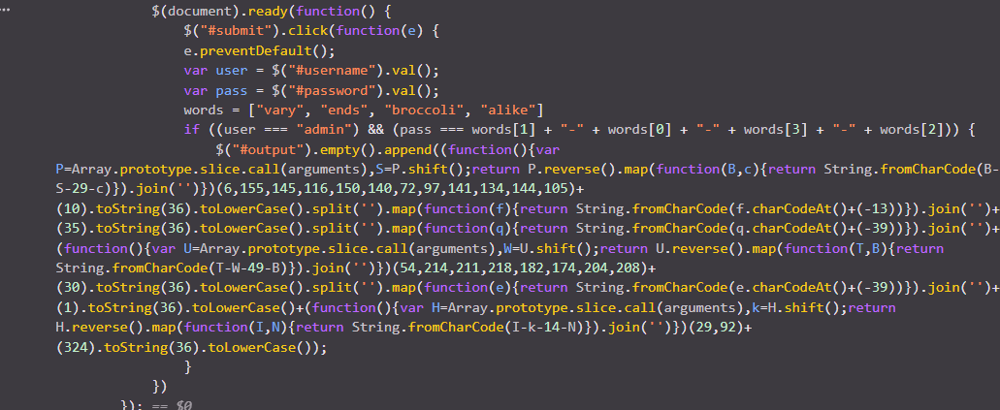
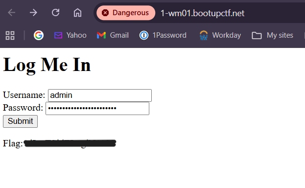

<div align="center">

# 🧠 Arrays in JavaScript  
## Client-Side Logic Analysis & Validation Bypass


</div>

---

### 🎯 Objective

Investigate a web application that validates user input using **JavaScript logic**.

The challenge title suggested that the solution involved understanding how **arrays were being used within client-side code**, likely to control access or validate input conditions.

This was fundamentally a **client-side logic inspection problem**.

---

### 🖥 Environment

| Tool | Purpose |
|-----|------|
| Web browser | Primary investigation interface |
| Browser developer tools | JavaScript inspection |
| Page source viewer | HTML and script review |
| Manual input testing | Validation behavior analysis |

---

### 📦 Step 1 — Access the Target Application

The challenge provided a web interface that required interacting with a form or input field.

The target site was opened in the browser.

📸 **Initial Application View**



At first glance, the interface appeared simple and did not expose the flag or solution directly.

Initial hypothesis:

The solution likely involved **inspecting the underlying client-side logic** controlling the page.

---

### 🔍 Step 2 — Inspect Page Source

The next step was to examine the page source to identify any embedded JavaScript logic.

Using the browser's **View Page Source** feature, the HTML and scripts were reviewed.

📸 **Page Source Inspection**



Within the page source, JavaScript code responsible for validating user input was identified.

---

### 🧪 Step 3 — Analyze JavaScript Logic

The embedded script included logic using a **JavaScript array**.

Arrays in JavaScript are commonly used to store:

- acceptable input values
- validation rules
- comparison data

Closer inspection revealed that the application compared user input against values stored inside an array.

📸 **JavaScript Validation Logic**



This indicated that the application relied entirely on **client-side validation** to control access.

---

#### 🔎 Analytical Observation

Client-side validation can easily be bypassed because:

- the code is fully visible to the user
- validation logic can be reverse engineered
- users can modify inputs directly

This makes client-side validation unsuitable as a security control.

---

### 🔄 Step 4 — Identify Validation Conditions

The JavaScript logic was analyzed to determine:

- what values the array contained
- how user input was compared against those values
- what condition triggered successful validation

This revealed how the application determined whether a user had provided a correct value.

---

### 🔐 Step 5 — Provide Valid Input

Once the validation logic was understood, the correct input could be derived directly from the JavaScript code.

Entering the expected value triggered the application's success condition.

📸 **Successful Validation**



This confirmed that the application relied on **client-side logic for access control**, allowing the validation to be bypassed through code inspection.

---

## 🧠 Methodology Framework Applied

```
Initial application access
      ↓
Page source inspection
      ↓
JavaScript discovery
      ↓
Array logic analysis
      ↓
Validation condition identification
      ↓
Correct input derived
      ↓
Access granted
```

---

## 🛠 Techniques Used

Primary techniques used:

- page source inspection
- browser developer tools
- JavaScript logic analysis
- manual validation testing

Key concept investigated:

```
Client-side validation
```

---

## 🛡 Defensive Insight

This challenge demonstrated a classic web security issue:

**Client-side validation should never enforce security controls.**

Because JavaScript executes on the client device:

- users can view the code
- validation logic can be reverse engineered
- checks can be bypassed

Secure applications must enforce validation **server-side**, where users cannot modify execution logic.

---

## 💡 Skills Reinforced

- Web application reconnaissance  
- JavaScript source inspection  
- Client-side validation analysis  
- Input validation bypass techniques  
- Secure design awareness for web applications  

---

<div align="center">

🧠 Never trust client-side validation  
🔍 Inspect application logic  
🌐 Security controls must exist on the server  

</div>
