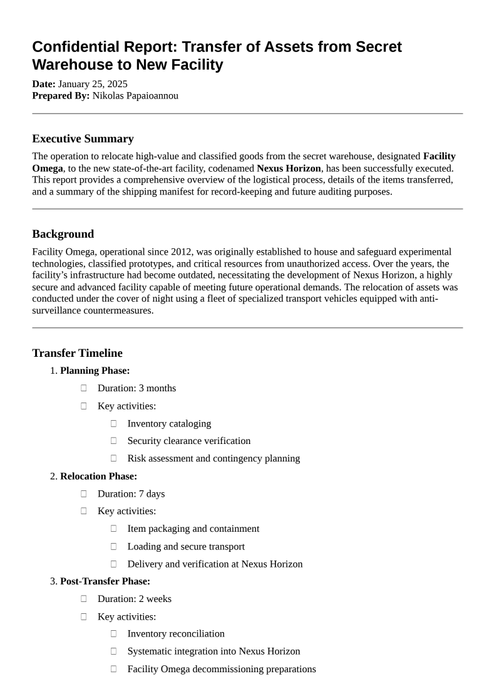
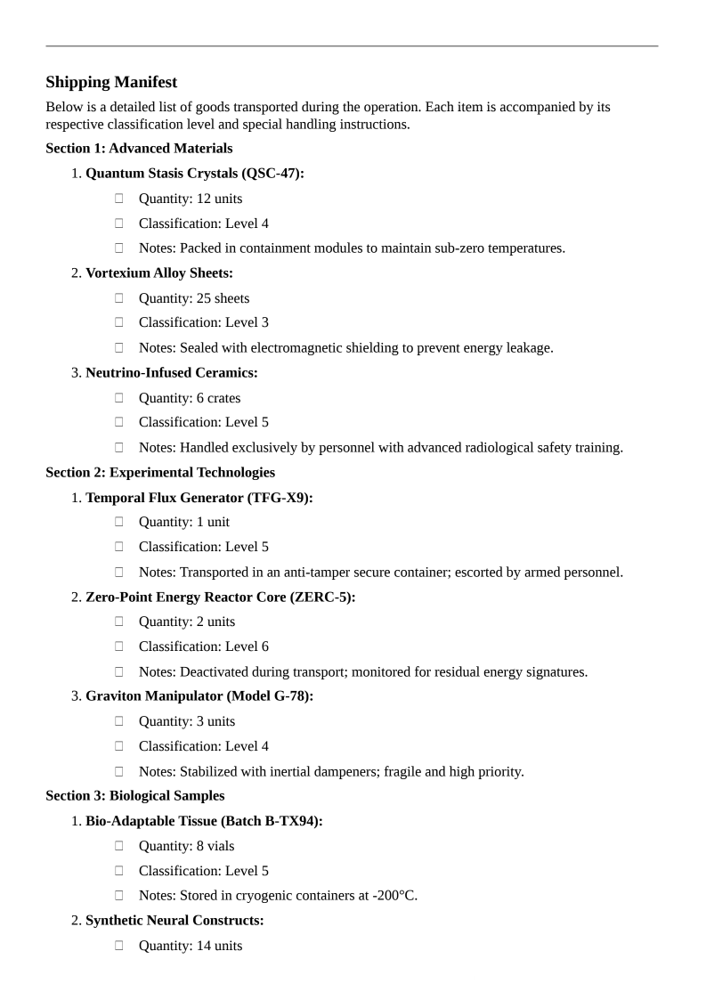

<div align="center">

# 🔑 Get Admin  
## Session & Cookie Manipulation Analysis


</div>

---

### 🎯 Objective

Investigate a web application that restricts administrative access and determine how to gain elevated privileges.

The challenge title suggested that the goal was to obtain **administrator-level access**, likely by manipulating how the application determines user roles.

This was fundamentally a **session and cookie manipulation problem**.

---

### 🖥 Environment

| Tool | Purpose |
|-----|------|
| Web browser | Primary investigation interface |
| Browser developer tools | Cookie inspection and modification |
| Storage / Application tab | Session data analysis |
| Manual request manipulation | Access control testing |

---

### 📦 Step 1 — Access the Application

The provided web interface was opened in a browser.

📸 **Initial Application View**



The application appeared to restrict administrative functionality, preventing normal users from accessing privileged content.

Initial hypothesis:

The application likely relied on **client-side session data** to determine whether a user was an administrator.

---

### 🔍 Step 2 — Inspect Session Data

Using the browser’s developer tools, the **Application / Storage tab** was opened to inspect stored session data.

This included:

- cookies
- local storage
- session storage

📸 **Session Cookie Inspection**



A cookie was identified that appeared to control the user role or authorization state.

---

### 🧪 Step 3 — Analyze Cookie Values

The cookie value was reviewed to determine whether it contained:

- a role indicator
- an encoded permission value
- a boolean flag controlling access

Example structure observed:

```
role=user
```

This suggested that the application was using a **client-controlled value** to determine whether the user had administrative privileges.

---

#### 🔎 Analytical Observation

If authorization decisions rely entirely on **client-side cookies**, the value can often be modified manually.

Because cookies are stored locally in the browser, users can edit them directly through developer tools.

This creates a potential **privilege escalation vulnerability**.

---

### 🔄 Step 4 — Modify the Authorization Cookie

Using the developer tools interface, the cookie value was manually modified.

Example modification:

```
role=admin
```

📸 **Cookie Value Modification**


After modifying the cookie, the page was refreshed to test whether the application would grant elevated access.

---

### 🔐 Step 5 — Confirm Privilege Escalation

Upon reloading the page with the modified cookie value, the application granted administrative access.

📸 **Admin Access Granted**


This confirmed that the application relied entirely on **client-controlled data to determine authorization state**, allowing privilege escalation through cookie manipulation.

---

## 🧠 Methodology Framework Applied

```
Application access
      ↓
Session cookie inspection
      ↓
Authorization logic identification
      ↓
Cookie value modification
      ↓
Privilege escalation attempt
      ↓
Administrative access confirmed
```

---

## 🛠 Techniques Used

Primary techniques used:

- browser developer tools
- cookie inspection
- manual cookie modification
- session manipulation testing

Key concept investigated:

```
Client-controlled authorization
```

---

## 🛡 Defensive Insight

This challenge demonstrated a common web security flaw:

**Authorization decisions should never rely on client-controlled values.**

Cookies can be modified by any user with access to browser developer tools.

Secure applications should instead:

- store authorization state server-side
- validate session tokens against server data
- implement proper role-based access control checks

Failure to enforce these protections can allow attackers to escalate privileges simply by modifying session data.

---

## 💡 Skills Reinforced

- Web session analysis  
- Cookie inspection and modification  
- Authorization logic investigation  
- Privilege escalation testing  
- Secure session design awareness  

---

<div align="center">

🔑 Never trust client-controlled authorization  
🔍 Inspect session data carefully  
🛡 Enforce privilege checks server-side  

</div>
