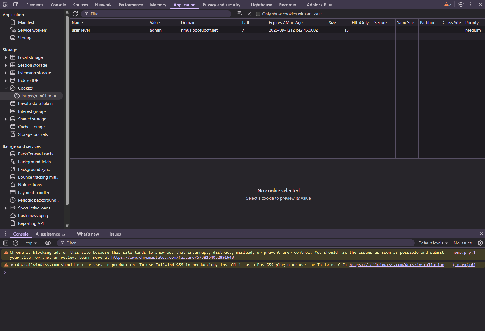
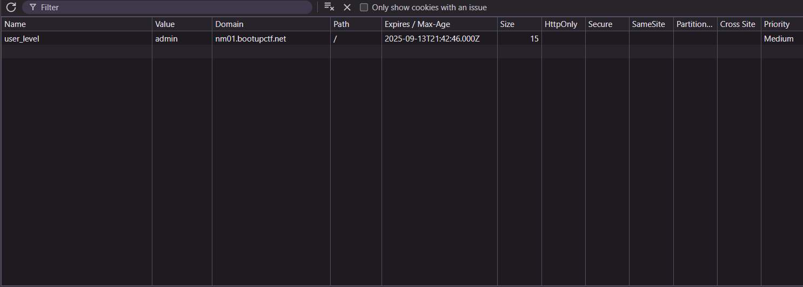
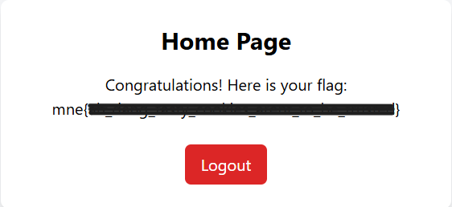

<div align="center">

# 🔑 Get Admin  
## Authentication Bypass via Client-Side Session Manipulation


</div>

---

### 🎯 Objective

Investigate a web application that restricts access to administrative functionality.

The objective was to determine whether administrative access could be obtained by analyzing and manipulating client-side session information.

This challenge focused on identifying weaknesses in **authentication and authorization mechanisms**.

---

### 🖥 Environment

| Tool | Purpose |
|-----|------|
| Web Browser | Application interaction |
| Browser Developer Tools | Inspect cookies and session data |
| Manual request testing | Identify authentication weaknesses |

---

### 📦 Step 1 — Access the Web Application

The challenge presented a login interface that restricted access to administrative functionality.

Initial inspection of the application suggested that user privileges were determined by **client-side session data**.

Because session information is stored within the browser, it can often be inspected and modified using developer tools.

📸 **Initial Application View**



---

### 🔍 Step 2 — Inspect Session Information

Browser developer tools were opened to inspect the cookies associated with the web session.

```
Developer Tools → Application → Cookies
```

Within the stored cookies, a field related to **user privilege or role** was identified.

📸 **Session Cookie Inspection**



The presence of role-related information in the cookie suggested that the application might be **relying on client-side data to determine authorization levels**.

---

### 🧪 Step 3 — Modify Client-Side Authorization Data

Because the authorization value was stored in the browser cookie, it could potentially be modified.

The role or privilege value within the cookie was manually edited using the developer tools.

After modifying the cookie value, the page was refreshed.

---

### 🔄 Step 4 — Gain Administrative Access

Following the cookie modification, the application granted access to the previously restricted administrative functionality.

📸 **Administrative Access Granted**



This confirmed that the application was relying solely on **client-side session data to enforce authorization**, which allowed privilege escalation.

---

## 🧠 Methodology Framework Applied

```
Application access
      ↓
Session inspection
      ↓
Cookie analysis
      ↓
Authorization field discovery
      ↓
Client-side modification
      ↓
Privilege escalation
```

---

## 🛠 Techniques Used

Primary investigation techniques:

- web application reconnaissance  
- browser developer tools inspection  
- session cookie analysis  
- client-side privilege escalation  

Key artifact analyzed:

```
Browser session cookies
```

Key vulnerability demonstrated:

```
Client-side authorization enforcement
```

---

## 🛡 Defensive Insight

Applications should **never rely on client-side data to enforce authorization decisions**.

Because cookies and browser storage can be modified by users, attackers can manipulate these values to escalate privileges.

Secure applications must enforce authorization **server-side**, ensuring that user privileges cannot be altered through client-side manipulation.

---

## 💡 Skills Reinforced

- Web application inspection  
- Cookie and session analysis  
- Client-side logic testing  
- Privilege escalation detection  
- Secure authentication design awareness  

---

<div align="center">

🔑 Authorization must be server-side  
🔍 Session data can reveal weaknesses  
🧠 Trusting the client is never secure  

</div>
