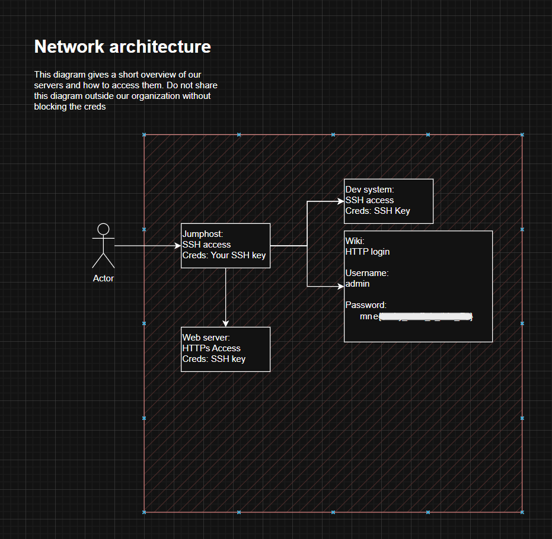

<div align="center">

# 🧩 Hidden Diagram Data  
## Artifact Analysis of Embedded Draw.io Metadata


</div>

---

### 🎯 Objective

Investigate a diagram file that appears to contain redacted information.

The goal of the challenge was to determine whether sensitive data was still present within the file despite appearing hidden in the rendered image.

The artifact was a **`.drawio.png` file**, which suggested the image may contain **embedded diagram metadata**.

---

### 🖥 Environment

| Tool | Purpose |
|-----|------|
| Kali / Ubuntu Linux VM | Investigation environment |
| Draw.io (diagrams.net) | Diagram editing and inspection |
| File inspection tools | Artifact analysis |
| Manual metadata review | Hidden data discovery |

---

### 📦 Step 1 — Acquire the Artifact

The challenge provided an image file containing a diagram that appeared to have sensitive data redacted.

At first glance, the diagram displayed only visible elements, suggesting that sensitive portions had been removed or obscured.

However, the file extension was:

```
.drawio.png
```

This indicated the file may contain **embedded diagram data**.

---

### 🔍 Step 2 — Identify the File Format

Files exported from **draw.io (diagrams.net)** often contain two components:

1. A **PNG image layer**
2. An **embedded XML diagram structure**

Even when information appears removed in the image layer, the **original diagram data may still exist within the embedded XML**.

This makes `.drawio.png` files a common source of accidental information disclosure.

---

### 🧪 Step 3 — Open the File in Draw.io

The file was opened directly in **draw.io (diagrams.net)**.

```
File → Open → Select diagram file
```

When the file loaded, the full editable diagram appeared.

This revealed that the information which appeared redacted in the PNG image **was still present in the editable diagram layer**.

📸 **Diagram Revealing Hidden Data**



Because the diagram data remained embedded in the file, the hidden content could easily be recovered.

---

### 🔄 Step 4 — Extract the Hidden Information

Once the diagram loaded in draw.io, the hidden elements were visible within the editable diagram objects.

This confirmed that the redaction had only been applied to the **visual layer of the PNG**, while the **diagram metadata still preserved the original content**.

This allowed recovery of the hidden value contained within the diagram.

---

## 🧠 Methodology Framework Applied

```
Artifact acquisition
      ↓
File format inspection
      ↓
Recognition of .drawio structure
      ↓
Open file in diagram editor
      ↓
Access embedded diagram data
      ↓
Recover hidden content
```

---

## 🛠 Techniques Used

Primary investigation techniques:

- artifact inspection  
- file format recognition  
- metadata analysis  
- diagram data extraction  

Key artifact analyzed:

```
.drawio.png file
```

Key concept demonstrated:

```
Embedded metadata disclosure
```

---

## 🛡 Defensive Insight

This challenge demonstrates a common real-world mistake in document handling.

Files exported from tools like **draw.io, PowerPoint, and PDF editors** often retain:

- hidden layers
- embedded metadata
- original editable content

Even when information appears visually removed, the underlying data may still be recoverable.

Organizations should ensure that sensitive files are **fully sanitized before sharing externally**.

---

## 💡 Skills Reinforced

- Digital artifact analysis  
- File format recognition  
- Metadata extraction  
- Diagram structure inspection  
- Information disclosure identification  

---

<div align="center">

🧩 Hidden data often lives in metadata  
🔍 File formats can reveal unintended information  
🧠 Always inspect the underlying structure  

</div>
