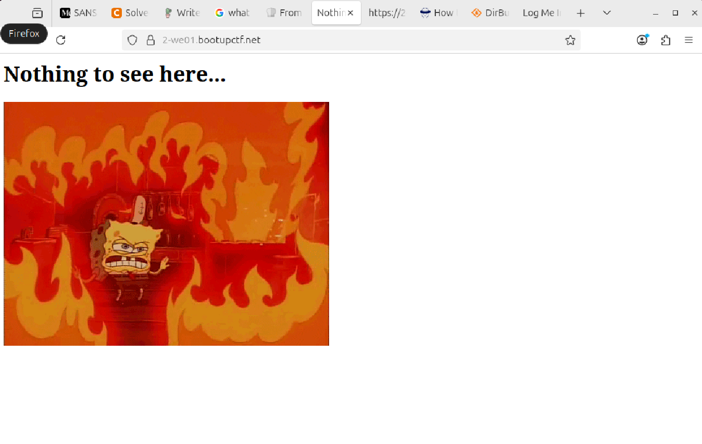
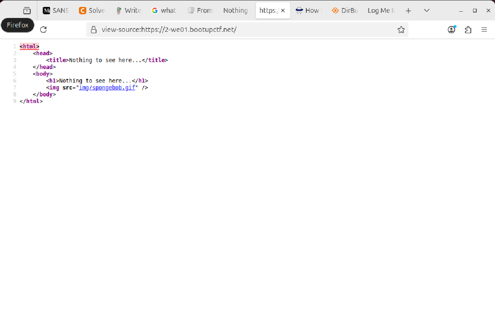
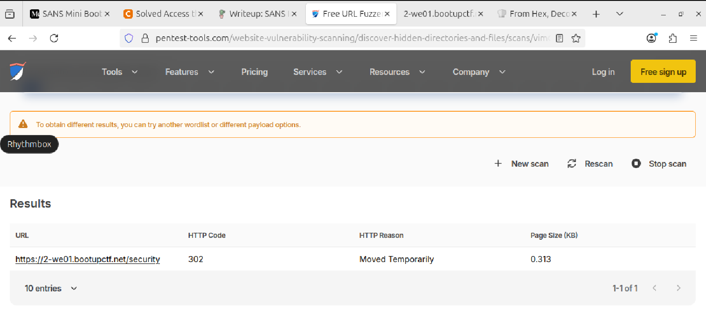
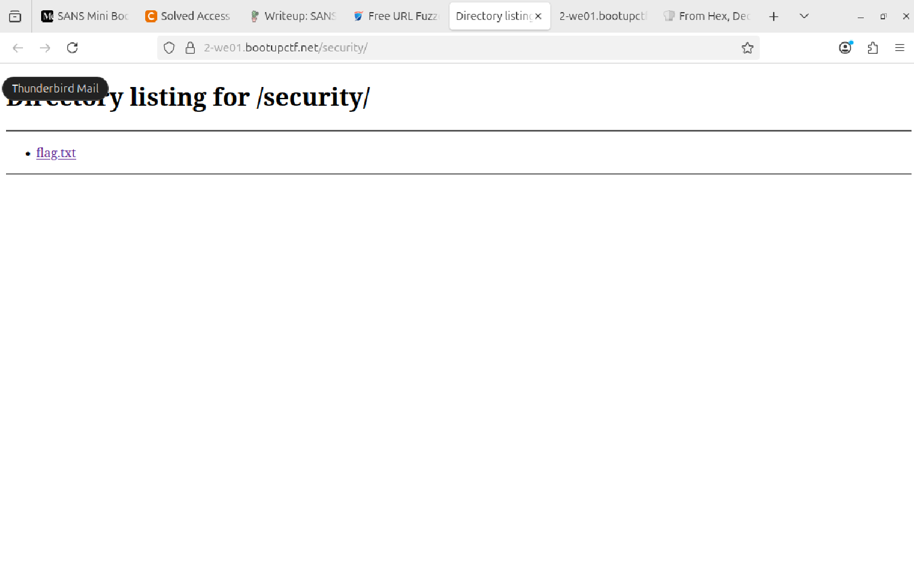
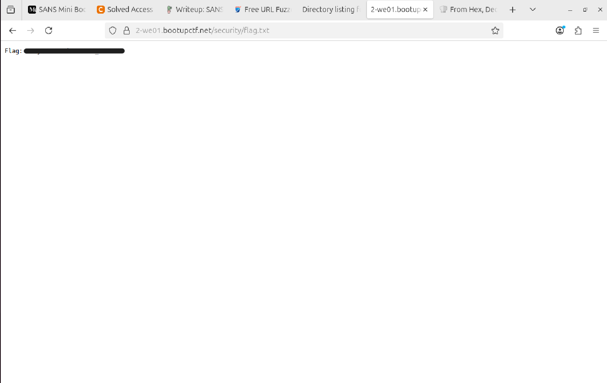

<div align="center">

# 🌐 Hidden Web Content  
## Web Enumeration & Information Disclosure Analysis


</div>

---

### 🎯 Objective

Access a web application and identify content that was not exposed through the visible site navigation.

The challenge title suggested that **not everything would be linked directly on the website**, indicating that the flag was likely stored in a hidden or unlinked resource.

This was fundamentally a **web enumeration and information disclosure problem**.

---

### 🖥 Environment

| Tool | Purpose |
|-----|------|
| Web browser | Primary investigation interface |
| Browser page source / developer tools | HTML inspection |
| Manual URL manipulation | Hidden path discovery |
| External web research | Enumeration strategy reference |

---

### 📦 Step 1 — Access the Target Website

The challenge provided a website that needed to be explored for hidden content.

The target was opened in a browser:

```text
https://2-we01.bootupctf.net/
```

📸 **Initial Website View**



At first glance, the site displayed normal content and no obvious flag or sensitive data.

Initial hypothesis:

The challenge likely required discovering a resource that was **not directly linked from the main page**.

---

### 🔍 Step 2 — Inspect the Visible Page

The visible site content was reviewed manually to identify any obvious navigation clues.

This included:

- checking page text
- reviewing visible links
- observing overall page structure

No flag was visible in the normal interface, and no obvious hidden element was exposed through standard browsing.

This suggested that the solution would require **looking beyond the rendered page**.

---

### 🧪 Step 3 — Inspect Page Source

The next step was to inspect the underlying HTML for references to hidden files, paths, or clues.

Using the browser’s page source / developer tools, the site code was reviewed.

📸 **Page Source Inspection**



The purpose of this step was to look for:

- hidden directories
- HTML comments
- unlinked resources
- alternate paths not visible in the rendered interface

---

#### 🔎 Analytical Observation

When a website challenge emphasizes that “not all things are linked,” this often suggests:

- **security through obscurity**
- hidden resources accessible only by direct URL
- incomplete or unlisted navigation

At this point, the investigation shifted from passive viewing to **resource discovery**.

---

### 🔄 Step 4 — Research Enumeration Strategy

After reviewing the source, external research was used to confirm common techniques for discovering unlinked files and directories.

This included reviewing concepts related to:

- URL fuzzing
- hidden file discovery
- manual directory enumeration

📸 **External Research on Hidden Directory Discovery**



This step provided supporting context for the next phase of the investigation.

---

### 🔗 Step 5 — Enumerate Hidden Resources

Using knowledge from the page source and the enumeration research, the site was manually explored for hidden paths.

This involved:

- testing alternative URL paths
- navigating directly to likely hidden resources
- checking whether unlisted pages were accessible without being linked from the homepage

📸 **Hidden Resource Accessed**



This confirmed that a valid unlinked resource existed and was accessible directly.

---

### 🔐 Step 6 — Confirm Information Disclosure

Once the hidden page was located, the content was reviewed and the challenge artifact became visible.

📸 **Hidden Content Revealed**



The discovery confirmed that the site exposed sensitive content through an **unlinked but accessible web resource**.

This demonstrated an **information disclosure issue caused by reliance on obscurity rather than access control**.

---

## 🧠 Methodology Framework Applied

```text
Initial website access
      ↓
Visible content review
      ↓
Page source inspection
      ↓
Enumeration strategy research
      ↓
Manual hidden path testing
      ↓
Hidden resource discovery
      ↓
Information disclosure confirmed
```

---

## 🛠 Commands / Techniques Used

Primary techniques used:

- browser-based manual inspection
- page source review
- developer tools
- direct URL manipulation
- enumeration research for hidden resources

Referenced concept:

```text
hidden directories / unlinked web resources
```

---

## 🛡 Defensive Insight

This challenge reinforced a common web security principle:

**Unlinked does not mean protected.**

If a resource is accessible by direct URL and lacks proper authorization checks, it can still be discovered through:

- page source inspection
- guessing common paths
- directory enumeration
- external fuzzing tools

Relying on obscurity instead of access control can expose sensitive content to attackers.

---

## 💡 Skills Reinforced

- Web application reconnaissance  
- Manual resource enumeration  
- Page source inspection  
- Hidden path discovery  
- Information disclosure analysis  
- Security-through-obscurity weakness recognition  

---

<div align="center">

🌐 Hidden does not mean secure  
🔍 Inspect beyond the rendered page  
🧠 Enumerate what the site does not reveal  

</div>
