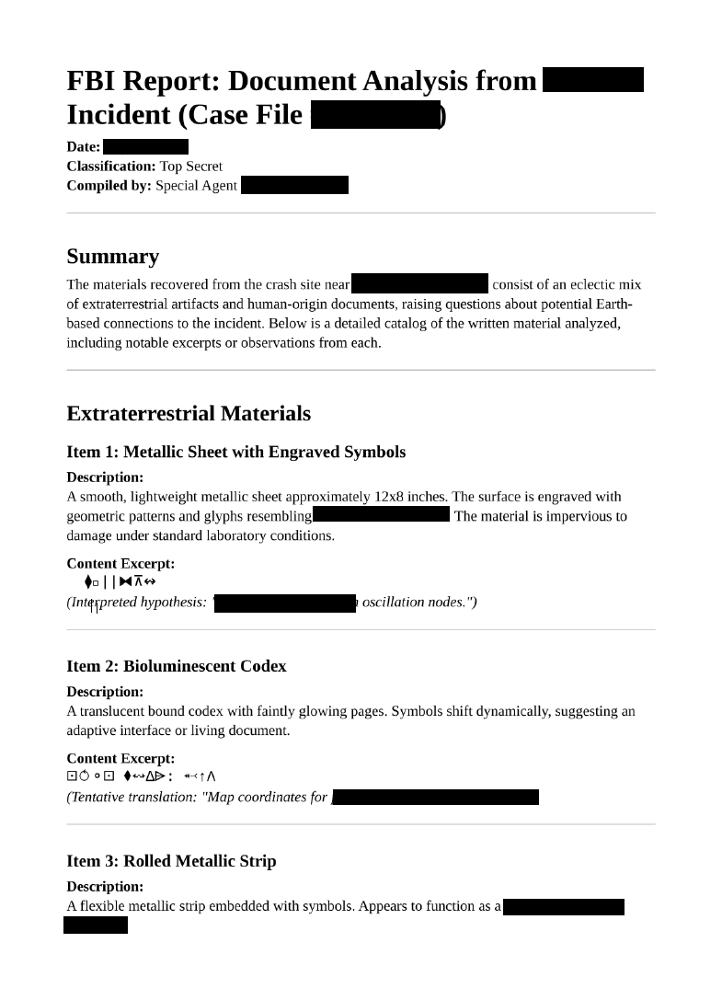
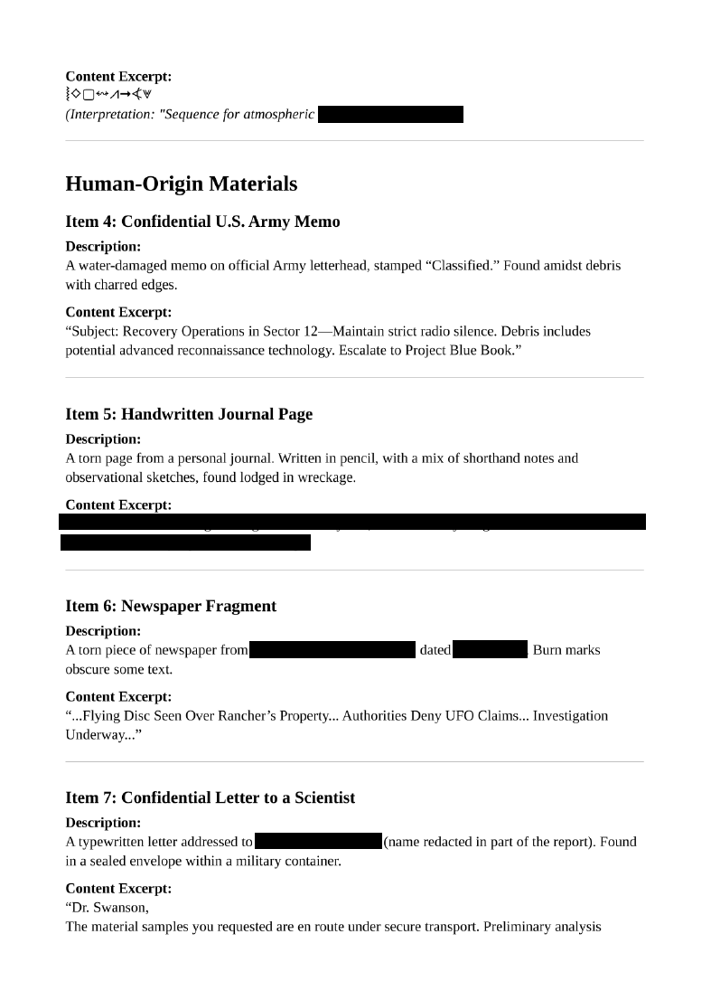

<div align="center">

# 🤖 Race My Robot  
## Static Code Review & Logic Flaw Analysis


</div>

---

### 🎯 Objective

Analyze a provided Python script controlling a simulated robot race and determine how to manipulate the program’s logic to achieve a successful outcome.

The challenge title suggested that the robot’s behavior was governed by **application logic within the source code**, meaning the correct approach would involve examining how the program processes inputs and determines results.

This was fundamentally a **static code analysis and logic flaw discovery problem**.

---

### 🖥 Environment

| Tool | Purpose |
|-----|------|
| Kali / Ubuntu Linux VM | Investigation environment |
| Python interpreter | Script execution |
| Text editor / IDE | Code inspection |
| Manual input testing | Behavior verification |

---

### 📦 Step 1 — Obtain the Source Code

The challenge provided access to a Python script controlling the robot race.

The script was downloaded or opened locally for analysis.

📸 **Python Script Provided**


Initial hypothesis:

The solution would likely involve identifying **how the script determines race results** and determining whether the logic could be manipulated.

---

### 🔍 Step 2 — Inspect Program Structure

The Python script was reviewed to understand:

- how the robot race was simulated
- what variables influenced race outcomes
- what conditions determined success or failure

📸 **Initial Code Inspection**


Key areas of interest included:

- conditional statements
- input validation logic
- variables affecting race results

---

### 🧪 Step 3 — Analyze Race Logic

The script contained logic responsible for determining whether the robot succeeded or failed during the race.

Example structure observed:

```
if robot_speed > opponent_speed:
    print("You win!")
```

This indicated that the race outcome was determined entirely by **variable comparisons within the program logic**.

---

#### 🔎 Analytical Observation

Because the program relied on values defined within the script, it was possible that modifying or manipulating those values could influence the outcome.

This meant the investigation focused on identifying:

- where critical variables were defined
- whether they could be influenced
- how the success condition was evaluated

---

### 🔄 Step 4 — Identify Logic Weakness

Further inspection revealed that the script did not adequately protect the variables controlling race results.

By understanding how the logic worked, it became possible to determine **what values would trigger the success condition**.

📸 **Race Logic Analysis**



This confirmed that the application relied on **predictable logic without safeguards**, allowing the correct outcome to be derived through code inspection.

---

### 🔐 Step 5 — Trigger Successful Outcome

After identifying how the race logic worked, the appropriate input or condition was used to trigger the success branch of the program.

📸 **Successful Execution**



This confirmed that the race outcome could be manipulated by understanding and leveraging the script’s internal logic.

---

## 🧠 Methodology Framework Applied

```
Program acquisition
      ↓
Source code inspection
      ↓
Logic flow analysis
      ↓
Variable dependency identification
      ↓
Success condition discovery
      ↓
Controlled execution
      ↓
Successful program outcome
```

---

## 🛠 Techniques Used

Primary techniques used:

- static code inspection
- logic flow analysis
- conditional statement evaluation
- controlled script execution

Key concept investigated:

```
Application logic vulnerabilities
```

---

## 🛡 Defensive Insight

This challenge highlights an important secure coding principle:

**Program logic must assume that attackers can read the source code.**

If application behavior can be predicted entirely from visible logic, attackers may:

- reverse engineer program behavior
- identify success conditions
- manipulate inputs to achieve desired results

Secure software design should include safeguards such as:

- server-side validation
- unpredictable decision logic
- stronger input validation mechanisms

---

## 💡 Skills Reinforced

- Static code analysis  
- Python program inspection  
- Logic flow evaluation  
- Conditional logic interpretation  
- Secure coding awareness  

---

<div align="center">

🤖 Read the code before running it  
🔍 Logic often reveals the weakness  
🧠 Understanding behavior leads to exploitation  

</div>
