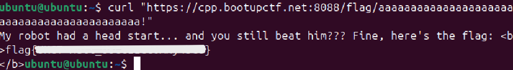

<div align="center">

# 🤖 Race My Robot  
## Static Code Review & Logic Flaw Analysis


</div>

---

### 🎯 Objective

Analyze a provided Python script controlling a simulated robot race and determine how to manipulate the program’s logic to achieve a successful outcome.

The challenge title suggested that the robot’s behavior was governed by **application logic within the source code**, meaning the correct approach would involve examining how the program processes inputs and determines results.

This was fundamentally a **static code analysis and logic flaw discovery problem**.

---

### 🖥 Environment

| Tool | Purpose |
|-----|------|
| Kali / Ubuntu Linux VM | Investigation environment |
| Python interpreter | Script execution |
| Text editor / IDE | Code inspection |
| Manual logic analysis | Understanding program behavior |

---

### 📦 Step 1 — Obtain the Source Code

The challenge provided access to a Python script responsible for simulating a robot race.

The script was opened locally for inspection and review.

Initial hypothesis:

The outcome of the race would likely depend on **logic embedded directly in the source code**, meaning that understanding the program flow would reveal how the challenge could be solved.

---

### 🔍 Step 2 — Inspect Program Structure

The Python script was reviewed to identify the core components controlling the robot race.

This included examining:

- variable assignments
- conditional statements
- race outcome logic
- input handling

The goal was to determine **how the program decided whether the robot succeeded or failed**.

---

### 🧪 Step 3 — Analyze Race Logic

Further inspection revealed conditional logic responsible for determining the outcome of the race.

Example structure:

```
if robot_speed > opponent_speed:
    print("You win!")
```

This indicated that the race outcome depended entirely on **specific variable values within the script**.

By identifying where these variables were defined and how they were used, it became possible to determine how the success condition could be triggered.

---

#### 🔎 Analytical Observation

Programs that rely entirely on visible logic can often be reverse engineered through static analysis.

Because the script was readable, it was possible to:

- understand the decision logic
- identify the success condition
- determine what values would trigger the winning outcome

This meant that solving the challenge required **logic analysis rather than brute-force experimentation**.

---

### 🔐 Step 4 — Trigger Successful Outcome

After identifying how the race logic worked, the correct condition was determined and applied.

📸 **Successful Program Outcome**



This confirmed that the race outcome could be influenced by understanding the script’s internal logic and identifying the conditions required for success.

---

## 🧠 Methodology Framework Applied

```
Source code acquisition
      ↓
Program structure inspection
      ↓
Logic flow analysis
      ↓
Conditional evaluation
      ↓
Success condition discovery
      ↓
Controlled execution
      ↓
Successful outcome
```

---

## 🛠 Techniques Used

Primary techniques used:

- static source code inspection
- Python logic analysis
- conditional evaluation
- controlled execution testing

Key concept investigated:

```
Application logic vulnerability
```

---

## 🛡 Defensive Insight

This challenge highlights an important secure coding principle:

**Program logic must assume that attackers can read the source code.**

If application behavior can be predicted entirely from visible logic, attackers may:

- reverse engineer program behavior
- identify success conditions
- manipulate inputs to achieve desired results

Secure software design should include safeguards such as:

- stronger input validation
- server-side logic enforcement
- avoidance of predictable success conditions

---

## 💡 Skills Reinforced

- Static code analysis  
- Python program inspection  
- Logic flow evaluation  
- Conditional logic interpretation  
- Secure coding awareness  

---

<div align="center">

🤖 Read the code before running it  
🔍 Logic often reveals the weakness  
🧠 Understanding behavior leads to exploitation  

</div>
