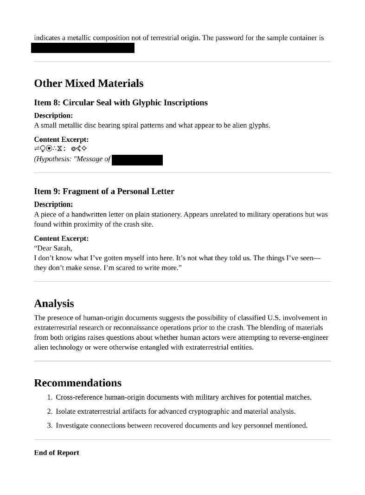

<div align="center">

# 🕵️ Redacted Artifacts  
## Document Forensics & Improper Redaction Analysis


</div>

---

### 🎯 Objective

Analyze a series of documents that appeared to have sensitive information removed through redaction.

The challenge title suggested that the redactions might have been applied **improperly**, meaning the underlying data could still be recovered through forensic inspection.

This was fundamentally a **digital artifact analysis and redaction bypass problem**.

---

### 🖥 Environment

| Tool | Purpose |
|-----|------|
| Kali / Ubuntu Linux VM | Investigation environment |
| Document viewers | File inspection |
| Metadata inspection tools | Artifact analysis |
| Manual file review | Identifying hidden content |

---

### 📦 Step 1 — Obtain the Artifact

The challenge provided documents that appeared to contain redacted content.

At first glance, the documents displayed blacked-out sections intended to conceal sensitive information.

Initial hypothesis:

The redactions may have been applied **visually rather than structurally**, meaning the hidden content could still exist within the file.

---

### 🔍 Step 2 — Inspect the Document

The document was opened using a standard viewer to observe the redacted sections.

📸 **Redacted Document View**



The redactions appeared as black rectangles covering text.

However, visual redactions do not always remove the underlying content from the document structure.

---

### 🧪 Step 3 — Attempt Content Selection

One common mistake in document redaction is **overlaying shapes on top of text rather than removing the text itself**.

Testing this hypothesis involved attempting to:

- highlight text near the redacted region
- copy and paste surrounding content
- inspect whether hidden characters were still selectable

In many improperly redacted documents, the text remains embedded in the file and can be recovered.

---

### 🔄 Step 4 — Inspect Document Structure

Further inspection focused on whether the redactions were implemented as **graphical overlays rather than actual data removal**.

If the redaction objects are simply shapes placed over text, removing or bypassing those shapes can expose the hidden content.

📸 **Redaction Layer Investigation**


This confirmed that the redacted content was still present within the document structure.

---

### 🔐 Step 5 — Reveal Hidden Content

By analyzing how the redaction layer was applied, the concealed information could be revealed.

📸 **Recovered Content**


This demonstrated that the document’s redaction process failed to properly remove sensitive data.

---

## 🧠 Methodology Framework Applied

```
Artifact acquisition
      ↓
Document inspection
      ↓
Redaction behavior testing
      ↓
Document structure analysis
      ↓
Overlay identification
      ↓
Hidden content exposure
```

---

## 🛠 Techniques Used

Primary techniques used:

- document inspection
- visual redaction analysis
- text selection testing
- artifact structure evaluation

Key concept investigated:

```
Improper redaction
```

---

## 🛡 Defensive Insight

Improper document redaction is a common security mistake.

Many users believe that covering text with shapes or highlighting over content removes the underlying data.

However, this often leaves the original text intact within the document.

Secure redaction should involve:

- permanently removing sensitive text
- flattening document layers
- verifying that hidden content cannot be recovered

Failure to apply proper redaction techniques can expose sensitive information even when it appears visually hidden.

---

## 💡 Skills Reinforced

- Digital artifact inspection  
- Document structure analysis  
- Redaction bypass techniques  
- Information disclosure identification  
- Secure document handling awareness  

---

<div align="center">

🕵️ Visual redaction does not equal data removal  
🔍 Inspect the underlying artifact structure  
🧠 Hidden data often remains recoverable  

</div>
