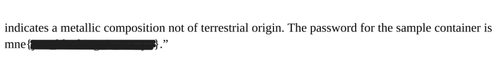

<div align="center">

# 🕵️ Redacted Artifacts  
## Document Forensics & Improper Redaction Analysis


</div>

---

### 🎯 Objective

Analyze a set of documents containing redacted information and determine whether the hidden content can be recovered.

The challenge suggested that the redactions may have been applied incorrectly. Instead of removing sensitive information from the document structure, the redaction process may have only **visually obscured the text**.

This investigation focused on identifying whether the redactions were **true removals or simple overlays**.

---

### 🖥 Environment

| Tool | Purpose |
|-----|------|
| Kali / Ubuntu Linux VM | Investigation environment |
| PDF viewer / editor | Inspect document structure |
| Object selection tools | Identify removable overlay elements |
| Manual artifact inspection | Determine whether data remains beneath redactions |

---

### 📦 Step 1 — Obtain the Documents

The challenge provided several files containing visibly redacted sections.

Initial inspection revealed multiple documents where portions of text were covered with black rectangles.

Initial hypothesis:

The redactions may have been implemented as **visual overlays rather than permanent removals**.

---

### 🔍 Step 2 — Inspect the Redacted Files

Opening the documents revealed black rectangles placed over sections of text.

📸 **Redacted Document Example**


At first glance the redactions appeared legitimate, but further inspection suggested the possibility that the underlying text layer remained intact.

---

### 🧪 Step 3 — Compare Additional Redacted Artifacts

Additional files showed similar redaction techniques.

📸 **Second Redacted Document**


The repeated formatting suggested that the same redaction method had been used across all documents.

This increased the likelihood that the redaction technique itself was flawed.

---

### 🔄 Step 4 — Investigate the Redaction Method

Closer inspection revealed that the redacted areas behaved like **independent graphical objects** placed on top of the document.

📸 **Redaction Overlay Structure**


This indicated that the redactions were likely applied as **overlay shapes**, rather than removing the original text.

If this assumption was correct, the underlying content might still be present within the document.

---

### 🔐 Step 5 — Remove Redaction Objects

Testing confirmed that the black redaction rectangles could be **selected and deleted individually**.

After clicking on each redacted section and removing the overlay objects, the hidden content underneath became visible.

📸 **Recovered Content (Flag Redacted for Repository)**



This demonstrated that the redaction process had **not removed the sensitive data**, only visually concealed it.

---

## 🧠 Methodology Framework Applied

```
Artifact acquisition
      ↓
Visual document inspection
      ↓
Redaction pattern comparison
      ↓
Overlay object identification
      ↓
Manual redaction removal
      ↓
Hidden content exposure
```

---

## 🛠 Techniques Used

Primary techniques used:

- document artifact inspection
- PDF layer analysis
- graphical overlay removal
- improper redaction discovery

Key vulnerability investigated:

```
Improper document redaction
```

---

## 🛡 Defensive Insight

Improper redaction is a common and dangerous data protection failure.

If redactions are applied using graphical overlays rather than removing the underlying text, attackers may be able to:

- select and delete the overlay objects  
- extract hidden text from the document layer  
- recover sensitive information  

Secure redaction requires:

- permanently removing sensitive text from the document
- flattening document layers
- verifying that the original data cannot be recovered

Many real-world data leaks have occurred due to this exact mistake.

---

## 💡 Skills Reinforced

- Digital artifact inspection  
- Document structure analysis  
- Redaction bypass investigation  
- Information disclosure analysis  
- Secure document handling awareness  

---

<div align="center">

🕵️ Visual redaction does not remove data  
🔍 Inspect document structure, not just appearance  
🧠 Hidden content often remains recoverable  

</div>
