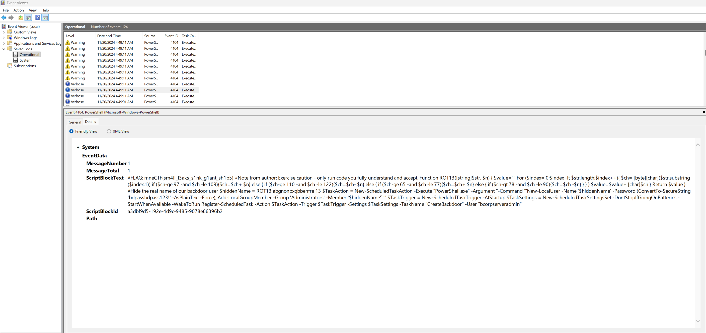

<div align="center">

# 🪟 Unwanted Visitor  
## Windows Authentication Log Investigation


</div>

---

### 🎯 Objective

Investigate suspicious activity on a compromised server using Windows event logs.

The investigation focused on identifying the **machine used by the attacker to authenticate to the compromised system**.

The challenge description suggested that the attacker had obtained **stolen credentials** and accessed the system through a **common remote access protocol**.

The goal was to analyze the available log files and determine the **hostname of the machine used during the attacker login event**.

---

### 🖥 Environment

| Tool | Purpose |
|-----|------|
| Kali / Ubuntu Linux VM | Investigation environment |
| Windows Event Logs | Authentication event analysis |
| Event Viewer / log viewer | Log inspection |
| Manual log filtering | Identifying suspicious authentication events |

---

### 📦 Step 1 — Acquire the Challenge Artifacts

The challenge provided a compressed archive containing Windows log files.

```
logs.zip
```

The archive was downloaded and extracted for investigation.

```bash
unzip logs.zip
```

This revealed multiple Windows Event Log files including:

- **Security.evtx**
- **Operational logs**

Initial hypothesis:

The attacker authentication event would likely appear in the **Security log**, which records login activity.

---

### 🔍 Step 2 — Initial Log Review

The investigation began by examining the **Operational logs** to identify any suspicious activity.

During this review, a string resembling a flag was discovered within the log details.

📸 **Initial False Flag Discovery**



The discovered value appeared to match the expected flag format.

However, submitting this value resulted in an incorrect answer.

---

### 🔄 Step 3 — Reevaluate the Investigation

Reexamining the challenge description revealed a critical detail:

```
Flag format: mne{HOSTNAME} (all upper case)
```

The previously discovered value did **not match the required format**, indicating it was likely a **decoy or unrelated artifact**.

The provided hint also suggested focusing specifically on:

```
Security.evtx
```

This indicated that the correct evidence likely existed within the **Windows Security log**, rather than the Operational logs initially reviewed.

---

### 🧪 Step 4 — Investigate Authentication Events

The Windows **Security.evtx** log records authentication activity.

A key event type for identifying login activity is:

```
Event ID 4624 — Successful Logon
```

These events contain valuable information including:

- Account Name
- Logon Type
- Source Network Address
- Workstation Name

Because the attacker logged into the system remotely, particular attention was given to:

```
Logon Type 3  — Network logon
Logon Type 10 — Remote interactive logon
```

Filtering for **Event ID 4624** allowed identification of successful login attempts during the timeframe of the compromise.

---

### 🔐 Step 5 — Identify the Attacker Hostname

Reviewing the authentication events revealed a login entry containing a **Workstation Name** field.

This field identifies the **hostname of the machine used during authentication**.

By examining the details of the relevant Event ID 4624 entry, the attacker workstation hostname was identified.

---

## 🧠 Methodology Framework Applied

```
Artifact acquisition
      ↓
Initial log inspection
      ↓
False lead discovery
      ↓
Challenge requirement verification
      ↓
Security log analysis
      ↓
Authentication event filtering
      ↓
Attacker workstation identification
```

---

## 🛠 Techniques Used

Primary investigation techniques:

- Windows event log analysis  
- authentication event investigation  
- log filtering and artifact validation  
- investigation pivoting after false leads  

Key artifact analyzed:

```
Security.evtx
```

Important event type:

```
Event ID 4624 — Successful Logon
```

---

## 🛡 Defensive Insight

Windows Security logs provide critical forensic evidence during incident investigations.

Important fields in authentication events include:

- **Logon Type** (how the login occurred)
- **Workstation Name** (source host)
- **Source Network Address**

Monitoring authentication logs can help defenders detect:

- stolen credential usage
- lateral movement
- suspicious remote logins

Proper log analysis enables defenders to **trace attacker activity back to its origin system**.

---

## 💡 Skills Reinforced

- Windows event log investigation  
- Authentication event analysis  
- Log filtering techniques  
- Investigation pivoting after false leads  
- Incident response methodology  

---

<div align="center">

🪟 Logs reveal attacker behavior  
🔍 Investigations require verification  
🧠 False leads are part of the process  

</div>
