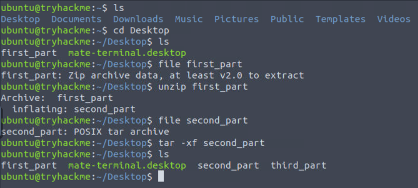
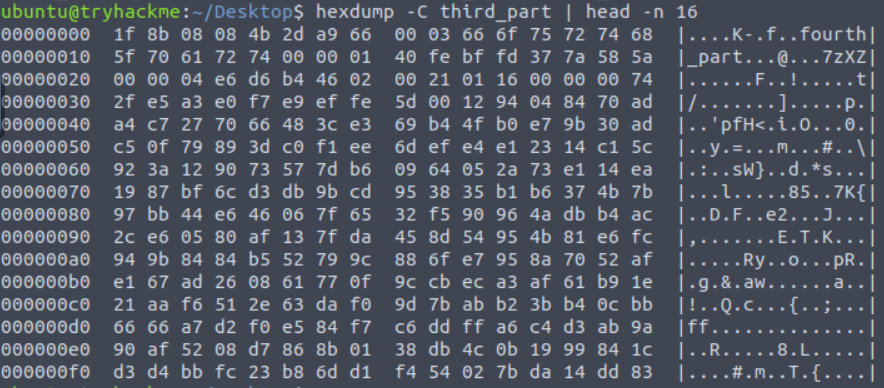
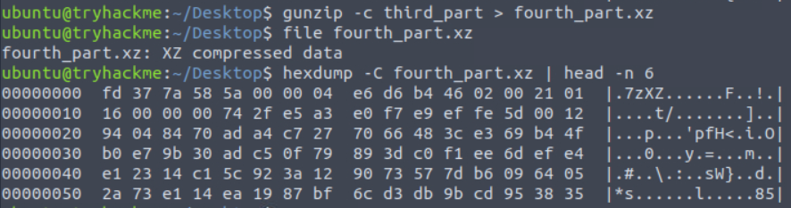
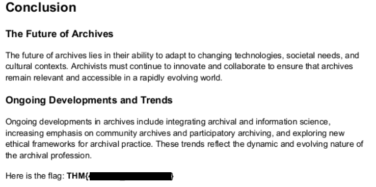

<div align="center">

# 📦 Archives  
## Multi-Layer Archive Analysis & File Recovery


</div>

---

### 🎯 Objective

Investigate an artifact containing confidential data hidden within multiple layers of compressed archives.

The challenge description indicated that the file extensions had been intentionally altered to obscure their true formats.

The objective was to identify the real file types, decompress each archive layer, and recover the hidden information.

---

### 🖥 Environment

| Tool | Purpose |
|-----|------|
| Kali Linux AttackBox | Investigation environment |
| Linux terminal | Command execution |
| `file` | Identify file signatures |
| `unzip` | Extract ZIP archives |
| `tar` | Extract TAR archives |
| `gzip` | Decompress gzip files |
| `xz` | Decompress xz files |
| `pdftotext` | Extract text from PDF documents |

---

### 📦 Step 1 — Locate the Artifact

The investigation began by navigating to the Desktop directory where the challenge artifact was stored.

```bash
cd Desktop
ls -l
```

Two files were present:

```
first_part
second_part
```

These files appeared to represent segments of a nested archive structure.

---

### 🔍 Step 2 — Identify the First Archive Layer

The first file was inspected to determine its true format.

```bash
file first_part
```

The output revealed that the file was actually a **ZIP archive**.

The archive was extracted using:

```bash
unzip first_part
```

📸 **First Archive Extraction**



Extracting the archive produced a new file:

```
second_part
```

---

### 🧪 Step 3 — Extract the TAR Archive

The second file was inspected to determine its format.

```bash
file second_part
```

The result indicated that the file was a **POSIX tar archive**.

The archive was extracted using:

```bash
tar -xf second_part
```

📸 **TAR Archive Extraction**



After extraction, a new file appeared:

```
third_part
```

---

#### 🔎 Analytical Observation

File extensions can be easily manipulated and should not be trusted as indicators of file type.

Tools like `file` analyze **file signatures (magic bytes)** instead of extensions, making them essential for forensic analysis and archive investigation.

---

### 🔄 Step 4 — Identify the Compression Format

The newly extracted file was inspected further.

```bash
hexdump -C third_part | head -n 16
```

📸 **Compression Signature Inspection**



The hex output revealed compression signatures indicating that the file was part of another compressed archive.

The data was decompressed and written to a new file:

```bash
gunzip -c third_part > fourth_part.xz
```

The new file was inspected again:

```bash
file fourth_part.xz
```

The result confirmed the file contained **XZ compressed data**.

---

### 🔐 Step 5 — Recover the Hidden Document

The final archive layer was decompressed.

```bash
xz -d fourth_part.xz
```

The resulting file was inspected:

```bash
file fourth_part
```

The output revealed a **PDF document**.

The contents of the document were extracted using:

```bash
pdftotext fourth_part -
```

📸 **Recovered Confidential Document**



The extracted document contained the hidden information required to complete the challenge.

```
THM{[redacted]}
```

---

## 🧠 Methodology Framework Applied

```
Artifact located
      ↓
File signatures inspected
      ↓
ZIP archive extracted
      ↓
TAR archive extracted
      ↓
Compression layers identified
      ↓
Nested archives decompressed
      ↓
Hidden document recovered
```

---

## 🛠 Techniques Used

Primary techniques used:

- file signature analysis  
- archive extraction  
- compression format identification  
- layered decompression  
- document inspection  

Key concept investigated:

```
Archive forensics
```

---

## 🛡 Defensive Insight

Attackers often hide malicious payloads or stolen data inside nested archives to evade detection.

Security teams should inspect file signatures rather than relying on extensions and analyze archives for hidden layers.

Defensive strategies include:

- scanning archives for nested content  
- validating file signatures during uploads  
- monitoring for unusual archive structures  

These controls help detect hidden or disguised data.

---

## 💡 Skills Reinforced

- Linux archive analysis  
- File signature identification  
- Compression and decompression techniques  
- Multi-layer artifact investigation  

---

<div align="center">

📦 File extensions can hide true formats  
🔍 File signatures reveal real data structures  
🧠 Layered archives require methodical extraction  

</div>
