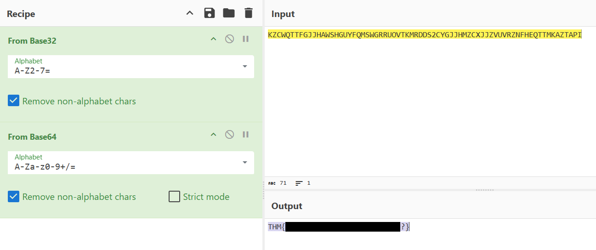

<div align="center">

# 🔐 B4sed  
## Multi-Layer Encoding Analysis & Cryptographic Decoding


</div>

---

### 🎯 Objective

Analyze an encoded message and determine how it was transformed before attempting to decode it.

The challenge provided a seemingly random string of characters that required cryptographic analysis to determine the encoding method.

The objective was to identify the encoding format and apply the appropriate decoding steps to reveal the hidden message.

---

### 🖥 Environment

| Tool | Purpose |
|-----|------|
| Web browser | Investigation interface |
| CyberChef | Encoding and decoding analysis |
| Manual inspection | Pattern recognition |

---

### 📦 Step 1 — Inspect the Encoded String

The challenge presented the following encoded text:

```
KZCWQTTFGJJHAWSHGUYFQMSWGRRUOVTKMRDDS2CYGJJHMZCXJJZVUVRZNFHEQTTMKAZTAPI=
```

Initial inspection suggested that the string followed the structure of a **Base encoding scheme**, due to:

- uppercase alphabetical characters  
- the presence of the `=` padding character  
- a consistent character set commonly used in Base encodings

Because the challenge name hinted at encoding ("B4sed"), the investigation focused on **Base-style encodings**.

---

### 🔍 Step 2 — Identify the Encoding Format

The encoded string was analyzed using **CyberChef**, a tool commonly used for cryptographic and encoding analysis.

Initial decoding attempts indicated that the string had been encoded **multiple times**, rather than using a single encoding layer.

This suggested that the message required **sequential decoding operations** to reveal the original text.

---

### 🧪 Step 3 — Apply Sequential Decoding

Using CyberChef, the encoded string was passed through multiple decoding operations.

By applying the correct decoding sequence, the encoded data gradually revealed readable content.

This confirmed that the message had been **encoded more than once using Base encoding techniques**.

---

#### 🔎 Analytical Observation

Layered encodings are commonly used in cryptography challenges to increase difficulty.

Instead of applying a single decoding operation, analysts must:

- identify the encoding format  
- determine whether multiple layers exist  
- apply decoding operations in the correct sequence

Tools like CyberChef are particularly useful for testing different decoding pipelines quickly.

---

### 🔄 Step 4 — Reveal the Decoded Message

After applying the correct decoding sequence, the hidden message became visible.

📸 **Decoded Message**



This confirmed that the encoded string contained a message that had been intentionally obfuscated through multiple encoding layers.

---

## 🧠 Methodology Framework Applied

```
Encoded string inspection
      ↓
Encoding pattern recognition
      ↓
Tool-assisted analysis
      ↓
Sequential decoding
      ↓
Original message revealed
```

---

## 🛠 Techniques Used

Primary techniques used:

- encoding pattern recognition  
- layered decoding analysis  
- CyberChef cryptographic tooling  

Key concept investigated:

```
Multi-layer encoding
```

---

## 🛡 Defensive Insight

Encoding techniques are often used to **obfuscate data rather than secure it**.

Unlike encryption, encoded data can typically be reversed easily if the encoding method is known.

Security systems should avoid relying on encoding as a protection mechanism for sensitive information.

Instead, proper cryptographic encryption methods should be used to protect confidential data.

---

## 💡 Skills Reinforced

- Encoding pattern recognition  
- Cryptographic analysis techniques  
- Layered decoding investigation  
- CyberChef usage for CTF analysis  

---

<div align="center">

🔐 Encoding hides information but does not secure it  
🔍 Multi-layer encodings require sequential decoding  
🧠 Pattern recognition is key to cryptographic challenges  

</div>
