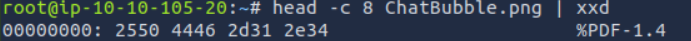
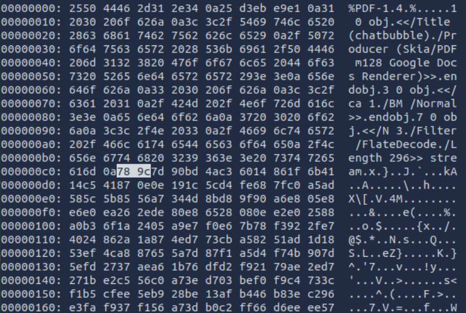
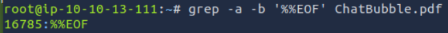
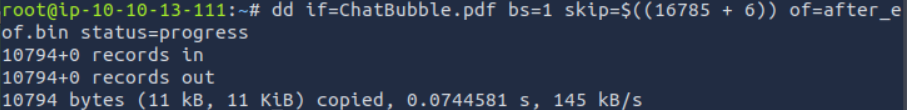
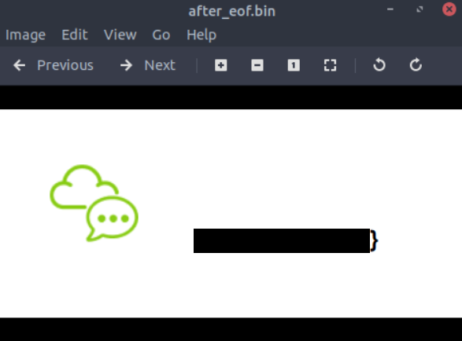

<div align="center">

# 💬 Chat Bubble  
## Polyglot File Analysis & Embedded Data Extraction


</div>

---

### 🎯 Objective

Investigate a file that appears to be one format on the surface but may contain additional hidden content.

The challenge description suggested that the file extension might not reflect the true structure of the data, requiring deeper inspection to determine its actual composition.

The objective was to analyze the file as a potential **polyglot artifact** and recover any hidden information embedded within it.

---

### 🖥 Environment

| Tool | Purpose |
|-----|------|
| Kali Linux AttackBox | Investigation environment |
| `wget` | Retrieve the provided file |
| CyberChef | Extract embedded compressed content |
| `file` | Identify file signatures |
| `xxd` | Hex inspection |
| `grep` | Locate file boundaries |
| `dd` | Extract embedded data |
| Terminal | Command execution and analysis |

---

### 📦 Step 1 — Retrieve and Inspect the File

The investigation began by downloading the file provided in the challenge.

```bash
wget http://10.10.133.71/ChatBubble.png
```

Although the file used a `.png` extension, the challenge hinted that the real file structure might be more complex.

The file was first examined in CyberChef, where the full contents were uploaded and analyzed for embedded structures.

📸 **Initial File Analysis**



This revealed that the file likely contained more than a standard image payload.

---

### 🔍 Step 2 — Reinterpret the File as an Alternate Format

Initial analysis showed indicators that the file also contained **PDF data**, suggesting that the artifact was a **polyglot file**.

To test that theory, the file was copied with a `.pdf` extension.

```bash
cp ChatBubble.png ChatBubble.pdf
```

Opening the renamed file revealed the first portion of the hidden message.

📸 **PDF Interpretation of the File**


This confirmed that the file could be interpreted successfully as a PDF, proving that it contained valid data for more than one file format.

---

### 🧪 Step 3 — Inspect the File in Hexadecimal Form

To understand how the file was structured internally, a hex dump of the PDF version was examined.

```bash
xxd ChatBubble.pdf | less
```

📸 **Hex Dump Inspection**



The dump revealed signs of compressed PDF stream data, including a `/FlateDecode` stream and the `78 9c` zlib header, indicating embedded compressed content.

---

#### 🔎 Analytical Observation

Polyglot files are crafted so that they can be interpreted as more than one valid format.

This challenge demonstrated several important indicators of embedded content:

- valid PDF structures inside a differently named file  
- compressed streams using zlib / Flate  
- meaningful data appended beyond expected file boundaries  

These characteristics often appear in steganography and file-format abuse challenges.

---

### 🔄 Step 4 — Locate the PDF Boundary

To determine whether additional hidden data existed beyond the logical end of the PDF document, the end-of-file marker was located.

```bash
grep -a -b '%%EOF' ChatBubble.pdf
```

This identified the byte offset of the PDF terminator.

📸 **PDF EOF Marker Discovery**



Finding the `%%EOF` marker made it possible to determine whether extra data had been appended after the PDF content.

---

### 🔐 Step 5 — Extract Data Appended After EOF

Once the end-of-file marker was identified, the bytes following it were extracted into a separate file for inspection.

```bash
dd if=ChatBubble.pdf bs=1 skip=$((16785 + 6)) of=after_eof.bin status=progress
file after_eof.bin
xxd -l 256 after_eof.bin | sed -n '1,20p'
```

📸 **Data Extraction After EOF**



This extraction revealed the remaining hidden content stored beyond the PDF boundary.

📸 **Recovered Hidden Data**



This confirmed that the artifact was a **polyglot file** containing multiple valid data structures and hidden content that could only be recovered through layered file analysis.

---

## 🧠 Methodology Framework Applied

```text
File retrieved
      ↓
Initial content inspection
      ↓
Alternate file format identified
      ↓
Hex structure analyzed
      ↓
EOF boundary located
      ↓
Appended data extracted
      ↓
Hidden information recovered
```

---

## 🛠 Techniques Used

Primary techniques used:

- file signature analysis  
- alternate format interpretation  
- polyglot file investigation  
- hexadecimal inspection  
- appended data extraction  
- compressed stream analysis  

Key concept investigated:

```text
Polyglot file analysis
```

---

## 🛡 Defensive Insight

File extensions should never be trusted as the sole indicator of content type.

Attackers can craft files that:

- masquerade as one format while containing another  
- append hidden data after logical end markers  
- embed compressed or secondary payloads בתוך legitimate-looking files  

Defensive best practices include:

- validating file signatures independently of extensions  
- scanning uploaded files for multiple embedded formats  
- inspecting appended data after file terminators  
- using content disarm and reconstruction where appropriate  

Polyglot files demonstrate how file parsing assumptions can be abused to hide data and bypass basic inspection.

---

## 💡 Skills Reinforced

- File signature analysis  
- Polyglot artifact investigation  
- Hexadecimal inspection  
- Embedded data extraction  
- Understanding PDF stream structures  
- Steganography and hidden content recovery  

---

<div align="center">

💬 A file can be more than one format at once  
🔍 Hidden data often lives beyond expected boundaries  
🧠 Hex inspection reveals what file extensions hide  

</div>
