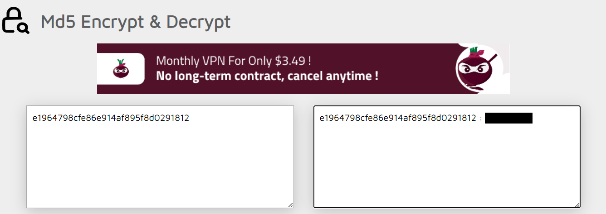

<div align="center">

# 🔓 CrackMyPass 1  
## MD5 Hash Analysis & Password Recovery Investigation


</div>

---

### 🎯 Objective

Analyze a leaked password hash from a website database and determine whether the original password can be recovered.

The challenge specified that the website used **MD5**, indicating that the investigation centered on identifying the hash type and testing whether the password could be reversed through lookup or cracking methods.

The objective was to recover the original password associated with the leaked MD5 hash.

---

### 🖥 Environment

| Tool | Purpose |
|-----|------|
| Web browser | Investigation interface |
| Online hash lookup tool | Hash reversal testing |
| Manual analysis | Hash type recognition |

---

### 📦 Step 1 — Inspect the Leaked Hash

The challenge provided a single leaked password hash taken from a website database.

```text
e1964798cfe86e914af895f8d0291812
```

Initial inspection showed that the value was a **32-character hexadecimal string**, which is a common indicator of an MD5 hash.

Because the challenge explicitly stated that the website used MD5, the next step was to attempt password recovery using an MD5 lookup approach.

---

### 🔍 Step 2 — Identify the Hash Type

MD5 produces a fixed-length hexadecimal digest and is commonly encountered in older systems and weak password storage implementations.

Key indicators included:

- 32 hexadecimal characters
- no visible salt
- challenge-provided confirmation that MD5 was in use

This suggested that the password may have been weak enough to exist in a public cracking or lookup database.

---

### 🧪 Step 3 — Perform Hash Lookup

With the hash type confirmed, the value was submitted to an online MD5 hash lookup service.

This method works by comparing the hash against previously indexed password-hash pairs collected from breached datasets and precomputed cracking tables.

Because MD5 is fast and widely broken for password storage purposes, weak passwords are often recoverable almost immediately through these lookup services.

---

#### 🔎 Analytical Observation

MD5 is unsuitable for password storage because it is:

- fast to compute
- easy to brute force
- vulnerable to rainbow table and lookup attacks
- commonly supported by public cracking databases

If passwords are not salted and hashed with a stronger algorithm, leaked hashes may reveal the original password with minimal effort.

---

### 🔄 Step 4 — Validate the Recovery Result

The lookup returned a readable password candidate associated with the supplied MD5 hash.

The result was consistent with the challenge objective and demonstrated that the original password had been recovered without the need for custom cracking scripts or brute-force wordlists.

This confirmed that the hash represented a weakly protected password.

---

### 🔐 Step 5 — Confirm Password Recovery

The recovered value satisfied the challenge requirement and demonstrated successful password recovery from the leaked MD5 hash.

📸 **Recovered Password from MD5 Hash**



This showed how weak password storage practices can allow exposed hashes to be reversed quickly using publicly available tools.

---

## 🧠 Methodology Framework Applied

```text
Leaked hash obtained
      ↓
Hash length and format inspection
      ↓
MD5 identified
      ↓
Online hash lookup performed
      ↓
Original password recovered
```

---

## 🛠 Techniques Used

Primary techniques used:

- hash format recognition  
- MD5 identification  
- online hash lookup  
- password recovery validation  

Key concept investigated:

```text
MD5 hash cracking
```

---

## 🛡 Defensive Insight

MD5 should never be used for password storage.

Modern password protection requires:

- slow password hashing algorithms such as bcrypt, scrypt, or Argon2  
- unique salts for every password  
- strong password policies  
- breach monitoring and credential rotation  

When weak hashes are leaked from a database, attackers may recover passwords almost instantly using public cracking resources.

---

## 💡 Skills Reinforced

- Hash type identification  
- Password recovery methodology  
- Understanding weaknesses in MD5  
- Recognizing insecure password storage practices  

---

<div align="center">

🔓 Weak hashes lead to fast password recovery  
🔍 Hash format recognition guides the attack path  
🧠 Passwords should be salted and hashed with modern algorithms  

</div>
