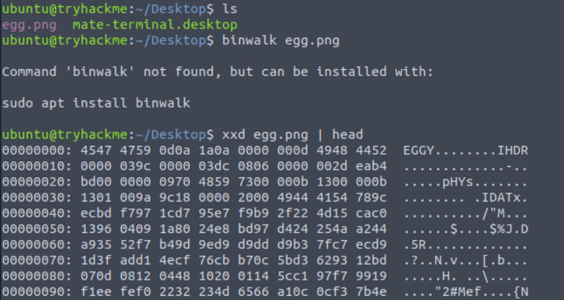
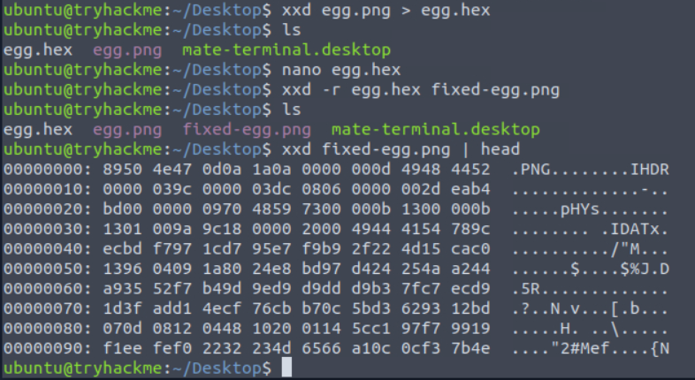

<div align="center">

# 🥚 Eggciting Recovery  
## OSINT Investigation & Hidden Data Discovery


</div>

---

### 🎯 Objective

Investigate a provided artifact suspected of containing hidden information.

The challenge hinted that sensitive data may be embedded within the file rather than immediately visible.

The goal was to perform **open-source intelligence (OSINT) techniques and artifact inspection** to determine whether the file contained hidden or recoverable information.

---

### 🖥 Environment

| Tool | Purpose |
|-----|------|
| Kali Linux AttackBox | Investigation environment |
| Web browser | OSINT research |
| Metadata inspection tools | Artifact analysis |
| Manual inspection | Hidden data discovery |

---

### 📦 Step 1 — Obtain the Artifact

The investigation began by downloading the artifact provided in the challenge.

At first glance, the file appeared normal and did not visibly expose any useful information.

Because OSINT challenges frequently hide clues within file structures or metadata, the next step was to perform deeper artifact inspection.

---

### 🔍 Step 2 — Inspect the File Structure

The artifact was examined to determine whether it contained hidden data or metadata fields.

📸 **Artifact Inspection**



Initial inspection revealed that the file contained additional embedded data beyond what was visible through standard viewing.

---

### 🧪 Step 3 — Analyze Embedded Data

Further investigation focused on analyzing any hidden information contained within the artifact.

📸 **Embedded Data Analysis**



This stage involved examining the file contents for:

- hidden text
- metadata entries
- embedded clues

These techniques often reveal information unintentionally left inside files.

---

#### 🔎 Analytical Observation

Many digital files contain metadata that may expose sensitive information.

Examples include:

- author names  
- file creation timestamps  
- embedded application identifiers  
- hidden comments or text fields  

OSINT investigators frequently analyze file metadata to uncover clues that were not meant to be publicly visible.

---

### 🔄 Step 4 — Identify the Hidden Clue

By analyzing the embedded data within the artifact, a clue relevant to the challenge objective was discovered.

📸 **Hidden Artifact Clue**


This discovery confirmed that the artifact contained concealed information that could only be revealed through deeper inspection.

---

### 🔐 Step 5 — Confirm Successful Data Recovery

After following the investigative trail contained within the artifact, the hidden information required to complete the challenge was successfully recovered.

📸 **Recovered Hidden Data**


This demonstrated how artifact inspection and OSINT techniques can uncover sensitive information that is not visible during normal file viewing.

---

## 🧠 Methodology Framework Applied

```
Artifact obtained
      ↓
Initial file inspection
      ↓
Metadata and embedded data analysis
      ↓
Hidden clue discovery
      ↓
Artifact investigation completed
```

---

## 🛠 Techniques Used

Primary techniques used:

- artifact inspection  
- metadata analysis  
- hidden data discovery  
- OSINT investigation techniques  

Key concept investigated:

```
File metadata analysis
```

---

## 🛡 Defensive Insight

Digital artifacts frequently contain hidden metadata that can unintentionally expose sensitive information.

Organizations should sanitize files before distributing them publicly to remove metadata that could reveal internal details.

Recommended practices include:

- metadata stripping before publishing documents  
- secure handling of shared artifacts  
- awareness of hidden file metadata  

Proper artifact management helps prevent unintended information disclosure.

---

## 💡 Skills Reinforced

- OSINT investigation techniques  
- Metadata analysis  
- Artifact inspection  
- Hidden information discovery  

---

<div align="center">

🥚 Hidden clues often exist inside digital artifacts  
🔍 Metadata analysis reveals unintended disclosures  
🧠 OSINT investigations rely on careful artifact inspection  

</div>
