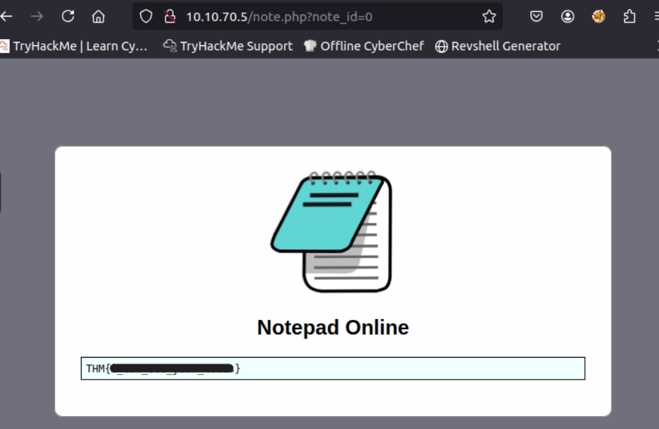

<div align="center">

# 📝 Notepad Online  
## Authorization Logic Analysis & Direct Object Reference Investigation


</div>

---

### 🎯 Objective

Investigate a web-based note-taking service that claims user notes are **only visible to the account owner**.

The challenge required analyzing how the application retrieves user notes and determining whether access controls were properly enforced.

The goal was to determine whether **direct object references within the application could expose other users’ data**.

---

### 🖥 Environment

| Tool | Purpose |
|-----|------|
| Web browser | Application interaction |
| Browser address bar | Parameter manipulation |
| Manual testing | Authorization validation |
| Application observation | Access control behavior |

---

### 📦 Step 1 — Access the Notepad Application

The investigation began by launching the provided virtual machine and navigating to the web application using the browser.

The challenge supplied credentials for accessing the service:

```
User: noel
Pass: pass1234
```

After authentication, the application displayed the user’s personal notes through a simple interface.

Initial observation suggested the application retrieved notes using a **numeric identifier embedded within the page URL**.

---

### 🔍 Step 2 — Inspect URL Parameters

Closer inspection of the browser’s address bar revealed a parameter similar to:

```
?id=1
```

This indicated that the application referenced notes using an internal **numeric identifier**.

Applications that rely on predictable identifiers can sometimes expose unintended resources if authorization checks are missing.

---

### 🧪 Step 3 — Test Parameter Manipulation

To test whether the application properly restricted access to notes, the identifier value in the URL was manually modified.

The parameter was changed from:

```
id=1
```

to

```
id=0
```

This simple modification forced the application to retrieve a different internal resource.

---

#### 🔎 Analytical Observation

This behavior suggested the application was vulnerable to an **Insecure Direct Object Reference (IDOR)**.

IDOR vulnerabilities occur when:

- internal object identifiers are exposed to the user
- authorization checks are missing
- users can access other objects by modifying identifiers

Instead of validating whether the authenticated user owned the requested resource, the application simply returned the object referenced by the parameter.

---

### 🔄 Step 4 — Analyze Application Response

After modifying the identifier, the application responded by displaying a different note stored within the system.

This confirmed that the application relied entirely on the **numeric identifier provided in the request**, without verifying whether the user was authorized to access the resource.

---

### 🔐 Step 5 — Confirm Unauthorized Data Access

The manipulated request revealed protected information that should not have been accessible to the authenticated user.

📸 **Unauthorized Note Access via Parameter Manipulation**



This demonstrated that the application allowed **unauthorized access to internal data through direct parameter manipulation**, confirming the presence of an IDOR vulnerability.

---

## 🧠 Methodology Framework Applied

```
Application login
      ↓
Interface reconnaissance
      ↓
URL parameter discovery
      ↓
Identifier manipulation
      ↓
Unauthorized resource retrieval
      ↓
Access control weakness confirmed
```

---

## 🛠 Techniques Used

Primary techniques used:

- application interface inspection  
- URL parameter analysis  
- manual parameter manipulation  
- authorization testing  

Key concept investigated:

```
Insecure Direct Object Reference (IDOR)
```

---

## 🛡 Defensive Insight

Applications must enforce **server-side authorization checks** whenever resources are requested.

If identifiers are exposed within URLs, the server must verify that the authenticated user is permitted to access the requested object.

Recommended security practices include:

- validating object ownership on the server  
- implementing proper access control checks  
- avoiding predictable sequential identifiers  
- monitoring for enumeration attempts  

Without proper authorization validation, attackers can iterate through identifiers to access sensitive data belonging to other users.

---

## 💡 Skills Reinforced

- Web application reconnaissance  
- Authorization control analysis  
- URL parameter manipulation  
- Identification of IDOR vulnerabilities  
- Understanding insecure direct object references  

---

<div align="center">

🔍 Test how applications reference internal objects  
🧠 Authorization must be enforced server-side  
🔐 Never trust identifiers supplied by the client  

</div>
