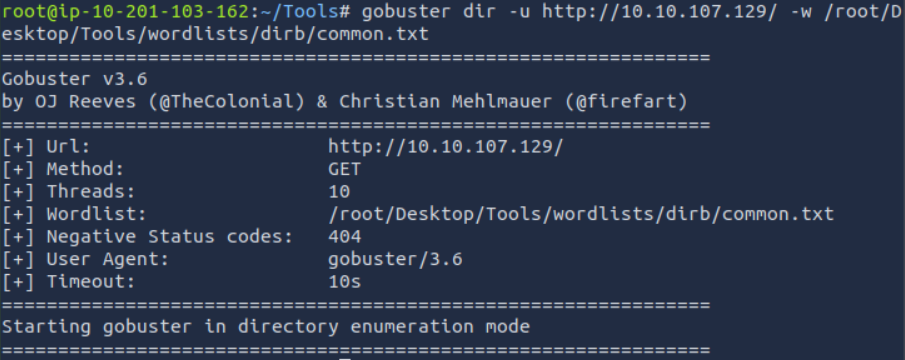
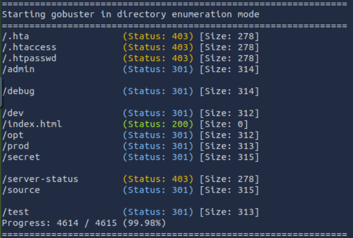
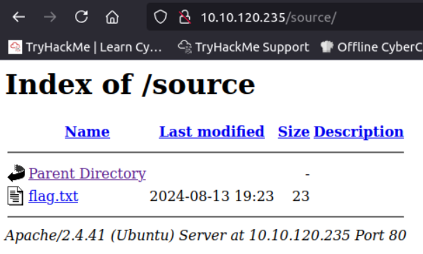
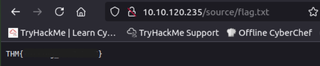

<div align="center">

# 🔎 Endpoint  
## Web Directory Enumeration & Hidden Resource Discovery


</div>

---

### 🎯 Objective

Investigate a web application suspected of containing hidden resources within its directory structure.

The challenge description suggested that important information may exist in **undocumented endpoints that are not linked from the main interface**.

The goal was to identify hidden resources by performing **web directory enumeration** against the target application.

---

### 🖥 Environment

| Tool | Purpose |
|-----|------|
| Web browser | Application interaction |
| Kali Linux AttackBox | Testing environment |
| Gobuster | Directory enumeration |
| Wordlists (dirb/common.txt) | Endpoint discovery |

---

### 📦 Step 1 — Access the Target Application

The investigation began by opening the provided web application in a browser.

📸 **Initial Application View**



At first glance, the interface appeared minimal and did not provide any obvious paths to sensitive information.

Initial hypothesis:

The application likely contained **hidden directories or endpoints not directly linked within the page interface**.

---

### 🔍 Step 2 — Perform Directory Enumeration

Since no useful information was immediately visible in the interface, automated directory enumeration was performed.

The **Gobuster** tool was used with a common directory wordlist to search for hidden paths within the web server.

📸 **Directory Enumeration Results**



Directory enumeration revealed the presence of an **undocumented endpoint** not accessible through normal navigation.

This indicated that the server hosted additional resources that were not visible through the primary interface.

---

### 🧪 Step 3 — Investigate Discovered Endpoint

After identifying the hidden endpoint, the discovered resource was accessed directly through the browser.

📸 **Hidden Endpoint Access**



The endpoint exposed information embedded within the application, confirming that the server hosted content that was **not intended to be easily discoverable through normal browsing**.

---

#### 🔎 Analytical Observation

Web applications frequently contain hidden resources that:

- are left over from development
- exist for administrative purposes
- contain internal functionality

Directory enumeration is a powerful technique because it can reveal **paths that developers assume users will never discover**.

---

### 🔄 Step 4 — Analyze Endpoint Response

The response from the discovered endpoint was analyzed to determine whether it exposed any sensitive information.

The returned content contained a message embedded within the application, demonstrating that enumeration had successfully uncovered hidden functionality.

This confirmed that the endpoint served as the location of the challenge artifact.

---

### 🔐 Step 5 — Confirm Information Disclosure

Once the endpoint was confirmed to contain the relevant information, the investigation verified that the discovery resulted directly from directory enumeration.

📸 **Successful Endpoint Discovery**



This demonstrated how hidden resources within web applications can expose sensitive data when enumeration techniques are applied.

---

## 🧠 Methodology Framework Applied

```
Initial application access
      ↓
Interface reconnaissance
      ↓
Directory enumeration
      ↓
Hidden endpoint discovery
      ↓
Endpoint inspection
      ↓
Sensitive information located
```

---

## 🛠 Techniques Used

Primary techniques used:

- web directory enumeration
- application reconnaissance
- endpoint discovery
- manual endpoint inspection

Key concept investigated:

```
Hidden web endpoints
```

---

## 🛡 Defensive Insight

Hidden endpoints should never be relied upon as a security mechanism.

If sensitive functionality exists at a location such as:

```
/admin
/debug
/hidden
```

it **must still be protected through authentication and authorization controls**.

Security best practices include:

- implementing proper access control
- restricting sensitive directories
- removing development artifacts before deployment
- monitoring enumeration activity

---

## 💡 Skills Reinforced

- Web application reconnaissance  
- Directory enumeration techniques  
- Endpoint discovery  
- Analysis of hidden web resources  
- Understanding web attack surface exposure  

---

<div align="center">

🔎 Hidden endpoints expand the attack surface  
🧠 Enumeration reveals undocumented resources  
🔐 Access control must protect all sensitive paths  

</div>
