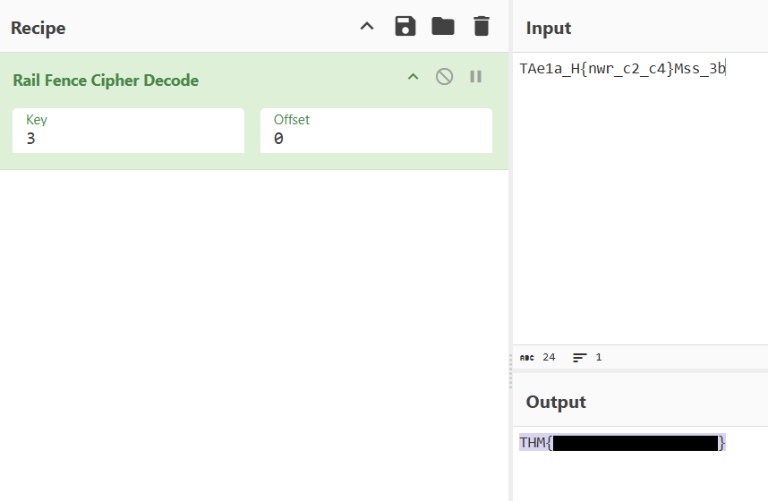

<div align="center">

# 🧪 Exam  
## Rail Fence Cipher Analysis & Cryptographic Decoding


</div>

---

### 🎯 Objective

Analyze an encrypted message received during a simulated exam scenario and determine the cipher used to conceal the answers.

The challenge description hinted that the sender had mentioned a **rail**, suggesting the message had been encrypted using a **Rail Fence cipher**.

The objective was to identify the encryption method and apply the correct decryption technique to reveal the hidden message.

---

### 🖥 Environment

| Tool | Purpose |
|-----|------|
| Web browser | Investigation interface |
| CyberChef | Cipher analysis and decoding |
| Manual inspection | Pattern recognition |

---

### 📦 Step 1 — Inspect the Encrypted Message

The challenge provided the following encrypted string:

```
TAe1a_H{nwr_c2_c4}Mss_3b
```

Initial inspection showed a mix of uppercase letters, lowercase letters, numbers, and special characters.

Because the challenge hinted at a **rail**, this suggested the message may have been encoded using a **Rail Fence cipher**, a classical transposition cipher.

---

### 🔍 Step 2 — Identify the Cipher Method

The Rail Fence cipher works by writing a message across multiple rows in a zig-zag pattern and then reading the rows sequentially.

For example:

```
H . . . O . . . L
. E . L . W . R .
. . L . . . O . .
```

This rearranges characters without changing them, making it a **transposition cipher rather than a substitution cipher**.

Using the challenge hint, the investigation focused on decoding the string using a Rail Fence cipher.

---

### 🧪 Step 3 — Decode Using CyberChef

The encrypted message was entered into **CyberChef**, and the **Rail Fence Decode** operation was applied.

Different rail values were tested until the decoded output produced a readable message.

This revealed the hidden message embedded within the encoded string.

---

#### 🔎 Analytical Observation

Rail Fence ciphers can often be identified through:

- irregular character ordering  
- readable fragments appearing when decoded  
- hints referencing rails or zig-zag patterns  

Because the cipher only rearranges characters rather than replacing them, it can often be reversed quickly using cryptographic analysis tools.

---

### 🔄 Step 4 — Reveal the Decoded Message

After applying the correct Rail Fence decoding configuration, the encrypted message resolved into a readable format.

📸 **Rail Fence Cipher Decoding**



This confirmed that the encoded message had been successfully decrypted using the Rail Fence cipher method.

---

## 🧠 Methodology Framework Applied

```
Encrypted message inspection
      ↓
Cipher hint identification
      ↓
Rail Fence cipher hypothesis
      ↓
Tool-assisted decoding
      ↓
Message reconstruction
```

---

## 🛠 Techniques Used

Primary techniques used:

- classical cipher analysis  
- Rail Fence cipher decoding  
- CyberChef cryptographic tools  

Key concept investigated:

```
Rail Fence Cipher
```

---

## 🛡 Defensive Insight

Classical ciphers such as Rail Fence provide **very limited security** and can be broken quickly using modern analysis tools.

Although useful for educational purposes, they should never be relied upon to protect sensitive information.

Secure systems should instead rely on **modern cryptographic algorithms and properly implemented encryption protocols**.

---

## 💡 Skills Reinforced

- Classical cipher recognition  
- Rail Fence cipher decoding  
- Cryptographic pattern analysis  
- CyberChef usage for cipher investigation  

---

<div align="center">

🧪 Cipher hints can reveal the encryption method  
🔍 Classical ciphers rely on character rearrangement  
🧠 Modern tools make decoding historical ciphers trivial  

</div>
