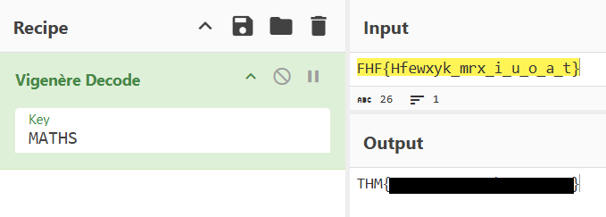

<div align="center">

# 🧪 Exam 2  
## Caesar Cipher Analysis & Cryptographic Decoding


</div>

---

### 🎯 Objective

Analyze an encrypted message discovered during the exam investigation and determine which classical cipher was used to conceal the information.

The message appeared to contain recognizable patterns, suggesting a simple substitution cipher rather than a complex encryption method.

The goal was to identify the cipher and apply the appropriate decoding technique to reveal the hidden message.

---

### 🖥 Environment

| Tool | Purpose |
|-----|------|
| Web browser | Investigation interface |
| CyberChef | Cipher analysis and decoding |
| Manual inspection | Pattern recognition |

---

### 📦 Step 1 — Inspect the Encrypted Message

The challenge provided a string of encoded text.

Initial inspection revealed that:

- characters remained alphabetic
- no symbols or padding were present
- the structure resembled readable text but shifted

These characteristics suggested the possibility of a **Caesar cipher**, one of the most common classical substitution ciphers.

---

### 🔍 Step 2 — Identify the Cipher Technique

The Caesar cipher works by shifting each character in a message by a fixed number of positions within the alphabet.

Example:

```
HELLO → KHOOR
```

Each letter is shifted three positions forward.

Because the exact shift value is often unknown, analysts typically test all possible shifts to locate the correct plaintext.

---

### 🧪 Step 3 — Test Multiple Shift Values

The encrypted string was entered into **CyberChef**, and the **ROT / Caesar cipher decoding** operation was applied.

Different shift values were tested until the decoded output began producing recognizable text.

This process is commonly referred to as **brute-force cipher analysis**.

---

#### 🔎 Analytical Observation

Caesar ciphers are vulnerable to brute-force analysis because they only contain **25 possible shifts**.

This makes them extremely easy to break using automated tools.

Indicators of Caesar cipher usage include:

- consistent alphabetic characters
- readable fragments appearing when shifts are tested
- preserved punctuation or spacing

---

### 🔄 Step 4 — Decode the Message

After testing several shift values, one configuration produced a readable message.

This confirmed that the encrypted text had been encoded using a Caesar-style substitution.

---

### 🔐 Step 5 — Confirm the Decoded Result

The correct shift revealed the hidden message required to complete the challenge.

📸 **Decoded Cipher Output**



This confirmed that the message had been successfully decoded through classical cipher analysis.

---

## 🧠 Methodology Framework Applied

```
Encrypted message inspection
      ↓
Cipher pattern recognition
      ↓
Caesar cipher hypothesis
      ↓
Brute-force shift testing
      ↓
Decoded message revealed
```

---

## 🛠 Techniques Used

Primary techniques used:

- classical cipher recognition  
- Caesar cipher brute-force analysis  
- CyberChef cryptographic tools  

Key concept investigated:

```
Caesar Cipher
```

---

## 🛡 Defensive Insight

Classical substitution ciphers such as Caesar provide **very weak protection** and can be broken almost instantly using automated tools.

Modern systems should instead rely on **strong cryptographic algorithms** that resist brute-force and statistical analysis.

Encoding or simple substitution methods should never be used to protect sensitive data.

---

## 💡 Skills Reinforced

- Classical cipher recognition  
- Caesar cipher decoding  
- Cryptographic pattern analysis  
- CyberChef usage for cipher investigation  

---

<div align="center">

🧪 Simple ciphers are easy to brute force  
🔍 Pattern recognition speeds up cryptanalysis  
🧠 Strong encryption is required for real security  

</div>
