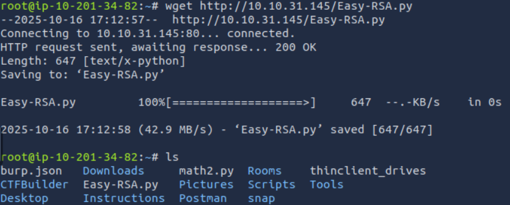
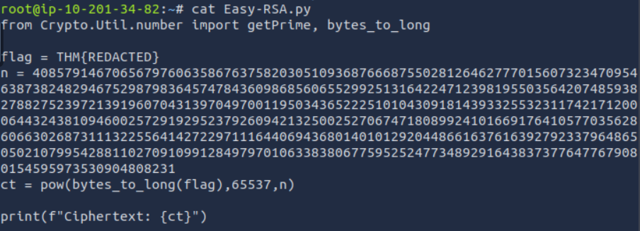
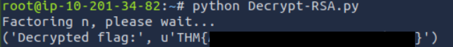

<div align="center">

# 🧪 Exam 3  
## RSA Script Analysis & Asymmetric Cryptography Decryption


</div>

---

### 🎯 Objective

Analyze an encrypted message and a provided Python encryption script to determine how the ciphertext was generated and how it could be reversed.

The challenge required downloading the encryption script, reviewing its logic, identifying the cryptographic scheme in use, and constructing a decryption workflow.

The objective was to recover the hidden message by exploiting weaknesses in the provided RSA implementation.

---

### 🖥 Environment

| Tool | Purpose |
|-----|------|
| Kali Linux AttackBox | Testing environment |
| `wget` | Retrieve the encryption script |
| Python 3 | Execute decryption code |
| `pycryptodome` | RSA number utilities |
| `sympy` | Integer factorization |
| Terminal | Script execution and analysis |

---

### 📦 Step 1 — Retrieve the Encryption Script

The challenge provided a large encrypted integer along with instructions to download the encryption script from the target machine.

The script was retrieved using:

```bash
wget http://TARGET_IP/Easy-RSA.py
```

Once downloaded, the file was opened for inspection to understand how the encryption process had been implemented.

At this stage, the working hypothesis was that the script would reveal the RSA parameters needed to recover the plaintext.

---

### 🔍 Step 2 — Inspect the RSA Implementation

The downloaded Python script was reviewed to identify the cryptographic logic being used.

📸 **Encryption Script Inspection**



Inspection showed that the challenge used **RSA-style asymmetric encryption**, including values associated with:

- the modulus `n`
- the public exponent `e`
- the ciphertext `ct`

This confirmed that the encrypted message had been generated with RSA and that successful decryption would depend on recovering the private key components.

---

### 🧪 Step 3 — Build a Decryption Workflow

After identifying RSA as the cryptographic scheme, the next step was to create a Python script capable of reversing the process.

Dependencies were installed first:

```bash
python3 --version
pip3 install pycryptodome sympy
```

A decryption script was then created to:

- factor the RSA modulus
- compute Euler’s totient
- derive the private exponent
- decrypt the ciphertext back into plaintext bytes

📸 **Decryption Script Creation**



This workflow relied on the ability to factor the modulus into its prime components, which would break the RSA implementation.

---

#### 🔎 Analytical Observation

RSA remains secure only when the modulus is large enough and infeasible to factor.

If an attacker can recover the prime factors of `n`, they can compute:

- `φ(n)`  
- the private exponent `d`  
- the original plaintext  

This challenge demonstrated that **weak or factorable RSA parameters undermine the entire encryption scheme**.

---

### 🔄 Step 4 — Execute the Decryption Script

The completed Python decryption script was executed against the provided ciphertext.

The script used mathematical operations to recover the private key material and then applied modular exponentiation to decode the message.

This confirmed that the encryption could be reversed because the modulus was factorable within the challenge environment.

---

### 🔐 Step 5 — Confirm Successful Decryption

Running the completed decryption script produced the hidden message successfully.

📸 **RSA Decryption Output**



This confirmed that the encrypted data had been recovered by analyzing the provided RSA script, factoring the modulus, and reconstructing the decryption key.

---

## 🧠 Methodology Framework Applied

```
Ciphertext provided
      ↓
Encryption script retrieved
      ↓
RSA logic identified
      ↓
Modulus factorization
      ↓
Private key reconstruction
      ↓
Ciphertext decrypted
```

---

## 🛠 Techniques Used

Primary techniques used:

- Python script review  
- RSA parameter analysis  
- modulus factorization  
- private key reconstruction  
- automated decryption with Python libraries  

Key concept investigated:

```
RSA cryptanalysis through factorization
```

---

## 🛡 Defensive Insight

RSA security depends on the practical difficulty of factoring the modulus.

If weak parameters are used, attackers may be able to recover the private key and decrypt protected data.

Secure cryptographic implementations should:

- use sufficiently large key sizes  
- generate strong primes securely  
- avoid exposing unnecessary implementation details  
- rely on vetted cryptographic libraries and best practices  

Improper RSA implementation can make strong cryptography fail completely.

---

## 💡 Skills Reinforced

- Cryptographic script analysis  
- RSA fundamentals  
- Python-based decryption workflows  
- Dependency installation and tooling setup  
- Understanding how factorization breaks asymmetric encryption  

---

<div align="center">

🧪 Cryptography fails when implementations are weak  
🔍 Script analysis can reveal the full attack path  
🧠 RSA security depends on strong key generation  

</div>
