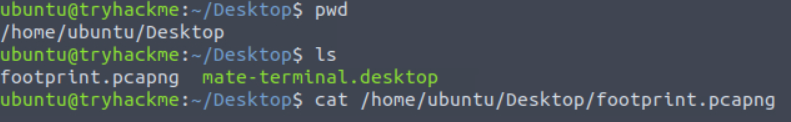
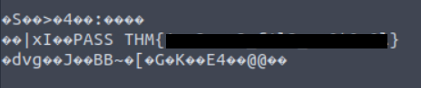

<div align="center">

# 👣 FooTPrints  
## Digital Footprint Analysis & OSINT Investigation


</div>

---

### 🎯 Objective

Investigate publicly available information to identify clues left behind through a digital footprint.

The challenge required analyzing information exposed through open sources to determine whether a user had unintentionally revealed sensitive details.

The objective was to use **open-source intelligence (OSINT) techniques** to trace and recover the hidden information.

---

### 🖥 Environment

| Tool | Purpose |
|-----|------|
| Web browser | OSINT research |
| Kali Linux AttackBox | Investigation environment |
| Search engines | Information discovery |
| Public data sources | Digital footprint analysis |

---

### 📦 Step 1 — Begin OSINT Investigation

The investigation began by reviewing the information provided in the challenge.

The scenario suggested that the target user had left clues online that could be discovered through public sources.

OSINT investigations often begin with identifying keywords, usernames, or references that may appear across multiple platforms.

---

### 🔍 Step 2 — Search for Publicly Available Information

Search engines and public resources were used to locate references associated with the target.

Digital footprints commonly appear in places such as:

- social media profiles  
- forums and message boards  
- developer repositories  
- public websites  

These sources often contain information that users unknowingly expose.

---

### 🧪 Step 3 — Identify the Digital Footprint

Further analysis of the available information revealed a clue tied to the target’s digital presence.

📸 **Digital Footprint Discovery**



This discovery confirmed that the target had left publicly accessible information that could be traced through open-source research.

---

#### 🔎 Analytical Observation

Digital footprints are created whenever users interact with online services.

Examples include:

- account usernames  
- profile descriptions  
- public posts  
- shared files or images  

OSINT investigations rely on correlating these traces to reconstruct a larger picture of the target’s activity.

---

### 🔄 Step 4 — Trace the Information Source

After identifying the digital footprint, the next step was to analyze where the information originated and whether it contained further clues.

By following the investigative trail, additional information could be uncovered that contributed to the challenge objective.

This process demonstrates how OSINT analysts correlate multiple sources to extract meaningful intelligence.

---

### 🔐 Step 5 — Confirm Successful Information Recovery

Following the digital footprint ultimately revealed the hidden information required to complete the challenge.

📸 **Recovered Information**



This confirmed that publicly available data had exposed the information needed to solve the investigation.

---

## 🧠 Methodology Framework Applied

```
Initial clue provided
      ↓
Open-source research performed
      ↓
Digital footprint identified
      ↓
Source correlation
      ↓
Information recovered
```

---

## 🛠 Techniques Used

Primary techniques used:

- open-source intelligence investigation  
- digital footprint analysis  
- public information correlation  
- investigative reasoning  

Key concept investigated:

```
Digital footprint discovery
```

---

## 🛡 Defensive Insight

Digital footprints often expose more information than users realize.

Publicly shared content may reveal:

- usernames across platforms  
- personal details  
- organizational affiliations  
- sensitive internal information  

Organizations should educate users about responsible online behavior and monitor public exposure of sensitive information.

---

## 💡 Skills Reinforced

- OSINT investigation techniques  
- Digital footprint analysis  
- Public information correlation  
- Online investigative research  

---

<div align="center">

👣 Every online action leaves a trace  
🔍 OSINT reveals connections between public data  
🧠 Digital footprints can expose hidden information  

</div>
