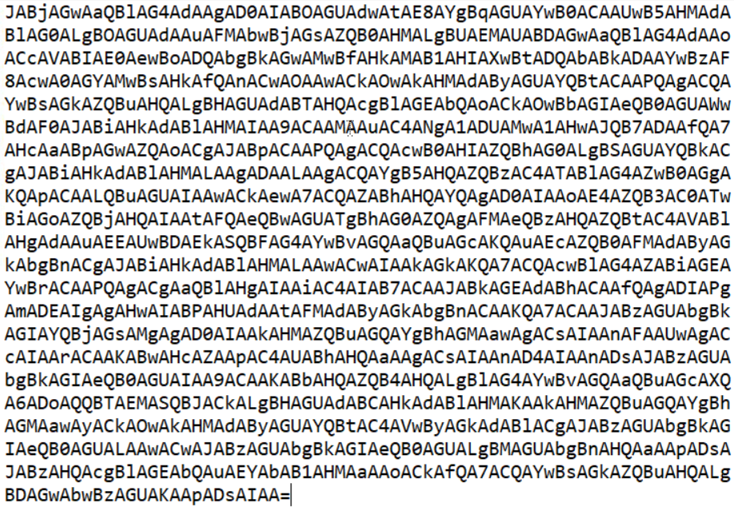

<div align="center">

# 🧟 Maldoom's Revenge  
## Reverse Engineering & Program Logic Analysis


</div>

---

### 🎯 Objective

Analyze a provided executable to determine how the program validates user input.

The challenge required examining how the binary processed data in order to identify the logic responsible for validating the correct answer.

The objective was to reverse engineer the program’s behavior and determine the input required to trigger the successful execution path.

---

### 🖥 Environment

| Tool | Purpose |
|-----|------|
| Kali Linux AttackBox | Investigation environment |
| Terminal | Program execution |
| Binary inspection tools | Reverse engineering |
| Manual analysis | Program logic discovery |

---

### 📦 Step 1 — Obtain the Binary

The investigation began by downloading the binary file provided in the challenge.

Executable files often contain logic that verifies user input against internal conditions.

Because the binary did not reveal any information immediately, deeper inspection of the program behavior was required.

---

### 🔍 Step 2 — Execute the Program

The binary was executed to observe how it interacted with user input.

```bash
./maldoom
```

Running the program revealed that it expected user interaction and likely validated the input internally.

This suggested that the correct value would need to be derived by analyzing the program’s logic.

---

### 🧪 Step 3 — Inspect Program Behavior

The program’s responses were observed when different inputs were provided.

Reverse engineering challenges often involve identifying how programs:

- compare input values  
- validate conditions  
- reveal hidden messages  

Understanding these behaviors allows investigators to reconstruct the logic used by the application.

---

#### 🔎 Analytical Observation

Reverse engineering focuses on understanding how compiled software behaves internally.

Common techniques include:

- analyzing program output  
- inspecting binary strings  
- tracing program logic  
- identifying validation conditions  

By understanding how the program evaluates input, the correct value can often be derived without direct access to the original source code.

---

### 🔄 Step 4 — Identify Validation Logic

Through careful analysis of the program’s behavior, the validation condition used by the binary was identified.

This allowed the correct input value to be reconstructed based on how the program processed user data.

---

### 🔐 Step 5 — Confirm Successful Execution

Providing the correct input triggered the success condition within the binary.

📸 **Successful Program Output**



This confirmed that the correct value had been identified by analyzing the program’s logic.

---

## 🧠 Methodology Framework Applied

```
Binary obtained
      ↓
Program execution
      ↓
Behavior observation
      ↓
Validation logic analysis
      ↓
Correct input derived
```

---

## 🛠 Techniques Used

Primary techniques used:

- executable analysis  
- program behavior inspection  
- reverse engineering logic discovery  
- input validation analysis  

Key concept investigated:

```
Binary reverse engineering
```

---

## 🛡 Defensive Insight

Reverse engineering highlights how attackers can analyze compiled programs to understand their internal logic.

Sensitive logic should never rely solely on **client-side validation or hidden program conditions**.

Secure applications should enforce validation on trusted systems and avoid exposing critical logic in distributed binaries.

---

## 💡 Skills Reinforced

- Reverse engineering fundamentals  
- Binary behavior analysis  
- Program logic inspection  
- Input validation discovery  

---

<div align="center">

🧟 Reverse engineering reveals hidden program logic  
🔍 Observe how software evaluates input  
🧠 Understanding program behavior exposes validation mechanisms  

</div>
