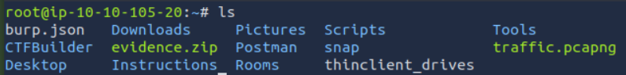

<div align="center">

# 💥 Mayhem  
## DFIR Investigation & Havoc C2 Traffic Decryption


</div>

---

### 🎯 Objective

Investigate a captured forensic dataset containing evidence of attacker activity.

The challenge description suggested that attacker activity was hidden within the evidence archive. The goal was to analyze the provided artifacts to determine how the attacker communicated with their command-and-control (C2) infrastructure and what information was retrieved.

The investigation focused on identifying encrypted attacker communications and recovering the information contained within them.

---

### 🖥 Environment

| Tool | Purpose |
|-----|------|
| Kali Linux AttackBox | Investigation environment |
| `wget` | Retrieve forensic evidence |
| `unzip` | Extract artifacts |
| Wireshark | Network traffic analysis |
| Manual analysis | C2 traffic investigation |

---

### 📦 Step 1 — Retrieve the Evidence

The investigation began by downloading the evidence archive from the provided location.

```bash
wget http://10.10.133.71/evidence.zip
```

The archive contained artifacts related to the attacker’s activity.

The archive was extracted to begin the analysis.

```bash
unzip evidence.zip
```

---

### 🔍 Step 2 — Inspect the Investigation Artifacts

After extraction, the files were reviewed to determine which artifacts contained relevant evidence.

Digital forensic investigations often begin by identifying:

- packet captures
- system logs
- attacker tools
- suspicious files

These artifacts help reconstruct attacker activity.

---

### 🧪 Step 3 — Identify Attacker Communication

Analysis of the artifacts revealed evidence of **command-and-control communication** associated with the attacker.

The communication appeared to be encrypted, indicating that the attacker was using a secure channel to communicate with their infrastructure.

Further investigation revealed that the attacker was using **Havoc C2**, a red-team command-and-control framework.

---

#### 🔎 Analytical Observation

Command-and-control frameworks often encrypt their traffic to prevent defenders from easily identifying attacker commands.

However, forensic analysis can sometimes recover the **encryption parameters used by the attacker**, allowing investigators to decrypt captured communications.

---

### 🔄 Step 4 — Recover the Encryption Parameters

Through analysis of the artifacts, the encryption key and initialization vector used by the attacker were recovered.

These parameters allowed the encrypted traffic to be decrypted and inspected.

```
AES Key and IV
```

```
946cf2f65ac2d2b868328a18dedcc296cc40fa28fab41a0c34dcc010984410ca8cd00c3e349290565aaa5a8c3aacd430
```

Recovering these values allowed the attacker communication to be decrypted.

---

### 🔐 Step 5 — Decrypt the Attacker Communication

Once the encryption parameters were identified, the captured C2 traffic could be decrypted.

📸 **Recovered Attacker Output**



The decrypted communication revealed that the attacker had printed a message containing a flag.

This confirmed that the encrypted traffic contained valuable forensic evidence.

---

### 🔄 Step 6 — Identify the Stolen File

Further investigation revealed that the attacker had accessed an important file during the compromise.

Inspecting the recovered artifacts exposed the final hidden message inside the file accessed by the attacker.

---

## 🧠 Methodology Framework Applied

```
Evidence archive obtained
      ↓
Artifacts extracted
      ↓
Attacker communication identified
      ↓
C2 framework recognized
      ↓
Encryption parameters recovered
      ↓
Traffic decrypted
      ↓
Attacker activity reconstructed
```

---

## 🛠 Techniques Used

Primary techniques used:

- digital forensic artifact analysis  
- network traffic investigation  
- command-and-control identification  
- encrypted traffic analysis  
- incident reconstruction  

Key concept investigated:

```
C2 traffic decryption
```

---

## 🛡 Defensive Insight

Attackers often rely on command-and-control frameworks to maintain persistent access and execute commands remotely.

Even when attacker communication is encrypted, forensic investigations can recover encryption parameters and reconstruct the attacker’s activity.

Organizations should implement:

- network monitoring and detection systems  
- endpoint detection and response (EDR)  
- traffic anomaly detection  
- incident response procedures

These controls help detect and investigate malicious command-and-control activity.

---

## 💡 Skills Reinforced

- Digital forensics investigation  
- C2 framework identification  
- Encrypted traffic analysis  
- Incident reconstruction  
- Threat hunting techniques  

---

<div align="center">

💥 Even encrypted traffic leaves forensic evidence  
🔍 Investigations reveal attacker infrastructure  
🧠 DFIR analysis reconstructs attacker behavior  

</div>
