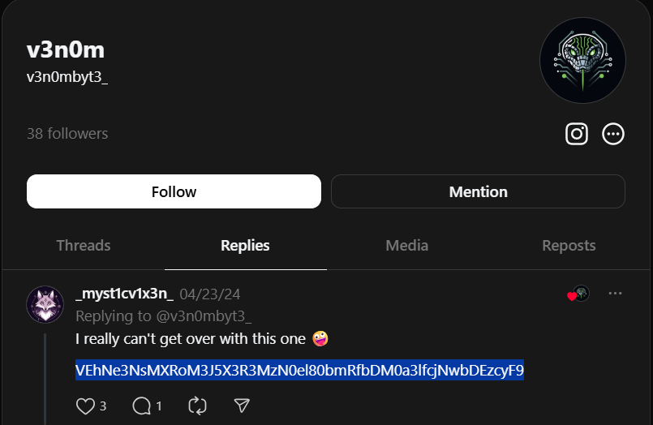
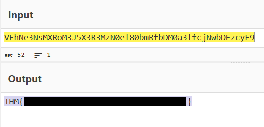

<div align="center">

# 🐍 Operation Slither 1  
## OSINT Investigation & Encoded Message Analysis


</div>

---

### 🎯 Objective

Investigate the online presence of a suspected threat actor in order to identify information about the leader of the **Sneaky Viper** group.

The challenge suggested that the attacker had begun leaking information online after gaining access to an organization's network.

The objective was to perform **open-source intelligence (OSINT) analysis** on the attacker’s social media activity and recover hidden information from their posts.

---

### 🖥 Environment

| Tool | Purpose |
|-----|------|
| Web browser | OSINT investigation |
| Social media platforms | Investigate attacker activity |
| CyberChef | Decode hidden data |
| Manual analysis | Identify encoded information |

---

### 📦 Step 1 — Identify the Threat Actor

The message associated with the leak referenced a user named:

```
@v3n0mbyt3_
```

This username appeared to belong to the individual responsible for posting about the data breach.

The next step was to investigate the user’s public activity online.

---

### 🔍 Step 2 — Investigate the Social Media Account

Searching for the username revealed a social media account associated with the threat actor.

Further inspection showed that the account had posted several messages related to the leak.

Investigators often examine attacker social media activity because threat actors sometimes reveal clues unintentionally.

---

### 🧪 Step 3 — Inspect Account Replies

The replies associated with the account were reviewed to determine whether they contained additional information.

The replies could be accessed through the user's Threads page.

📸 **Threat Actor Account Activity**



One of the replies contained text that appeared to be **encoded data**, suggesting that the attacker had hidden a message within the post.

---

#### 🔎 Analytical Observation

Threat actors sometimes hide information inside encoded messages posted publicly.

Common encoding techniques include:

- Base64
- hexadecimal encoding
- URL encoding
- custom obfuscation

These techniques allow attackers to hide information in plain sight.

---

### 🔄 Step 4 — Extract the Encoded Message

The encoded text from the post was copied and analyzed to determine what type of encoding was used.

Because encoded messages often follow recognizable patterns, decoding tools can be used to reveal the hidden content.

---

### 🔐 Step 5 — Decode the Message

The extracted text was placed into **CyberChef** for analysis.

CyberChef allows investigators to quickly test decoding techniques and identify hidden data.

📸 **Decoded Message Output**



The decoded output revealed the hidden information associated with the Sneaky Viper group.

---

## 🧠 Methodology Framework Applied

```
Threat actor identified
      ↓
Social media investigation performed
      ↓
Suspicious reply discovered
      ↓
Encoded message extracted
      ↓
Data decoded
      ↓
Hidden information recovered
```

---

## 🛠 Techniques Used

Primary techniques used:

- OSINT investigation  
- social media analysis  
- encoded message identification  
- CyberChef decoding  

Key concept investigated:

```
Encoded data in public posts
```

---

## 🛡 Defensive Insight

Threat actors sometimes use public platforms to distribute encoded messages or communicate indirectly.

Security teams should monitor public sources for:

- suspicious user activity  
- encoded messages  
- leaked organizational data  

OSINT monitoring can provide early indicators of ongoing attacks or data leaks.

---

## 💡 Skills Reinforced

- OSINT investigation  
- Social media intelligence gathering  
- Encoded message identification  
- Data decoding techniques  

---

<div align="center">

🐍 Threat actors often leave clues online  
🔍 OSINT investigations reveal hidden activity  
🧠 Encoded messages can hide sensitive information  

</div>
