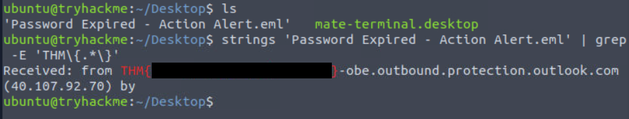

<div align="center">

# 🎣 Phishy  
## Script Analysis & Reverse Engineering Investigation


</div>

---

### 🎯 Objective

Investigate a provided script suspected of containing hidden logic related to authentication or validation.

The challenge required examining the script to understand how it processed input and determine whether sensitive information could be recovered through analysis.

The objective was to reverse engineer the script’s behavior and identify the value required to trigger the successful execution path.

---

### 🖥 Environment

| Tool | Purpose |
|-----|------|
| Kali Linux AttackBox | Investigation environment |
| Terminal | Script inspection |
| Text editor | Code review |
| Manual analysis | Logic discovery |

---

### 📦 Step 1 — Obtain the Script

The investigation began by downloading the script provided in the challenge environment.

Scripts often contain logic that validates user input or processes hidden data internally.

Because the script did not immediately reveal useful information when executed normally, the next step was to inspect the code directly.

---

### 🔍 Step 2 — Inspect the Script Contents

The script was opened for inspection to determine how it processed input.

```bash
cat phishy
```

Reviewing the script revealed logic responsible for validating user input against internal conditions.

Script analysis often exposes:

- hidden strings  
- encoded values  
- validation conditions  
- logic branches  

Understanding this behavior helps identify the values required for successful execution.

---

### 🧪 Step 3 — Analyze the Validation Logic

Further inspection of the script revealed how it compared user input to internal values.

Reverse engineering scripts often involves identifying:

- hardcoded values  
- encoded data  
- conditional checks  

By analyzing these elements, it becomes possible to determine the expected input required to satisfy the script’s conditions.

---

#### 🔎 Analytical Observation

Scripts frequently contain validation logic that developers assume users will not inspect.

However, because scripts are plain text files, attackers can easily analyze them to determine how authentication or validation processes work.

This makes **code inspection a powerful reverse engineering technique**.

---

### 🔄 Step 4 — Derive the Correct Input

After identifying the script’s validation logic, the expected value could be derived.

Providing the correct input triggered the script’s success condition.

This confirmed that the validation process could be bypassed by understanding the program logic.

---

### 🔐 Step 5 — Confirm Successful Execution

Once the correct value was identified, the script returned the success message required to complete the challenge.

📸 **Successful Script Output**



This demonstrated that the hidden value could be recovered by analyzing the script’s logic.

---

## 🧠 Methodology Framework Applied

```
Script obtained
      ↓
Code inspection performed
      ↓
Validation logic identified
      ↓
Expected input derived
      ↓
Script executed successfully
```

---

## 🛠 Techniques Used

Primary techniques used:

- script inspection  
- logic analysis  
- reverse engineering of validation conditions  
- manual code review  

Key concept investigated:

```
Script reverse engineering
```

---

## 🛡 Defensive Insight

Scripts should not contain sensitive validation logic that relies on obscurity.

If attackers can read the code, they can often determine how authentication checks work and bypass them.

Secure applications should enforce validation on trusted systems and avoid exposing sensitive logic within distributed scripts.

---

## 💡 Skills Reinforced

- Script reverse engineering  
- Code inspection techniques  
- Validation logic analysis  
- Input derivation from program logic  

---

<div align="center">

🎣 Scripts can expose hidden validation logic  
🔍 Code inspection reveals how programs process input  
🧠 Understanding logic allows validation bypass  

</div>
