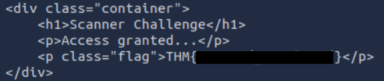

<div align="center">

# 📡 Scanner  
## Service Discovery & Non-Standard Port Analysis


</div>

---

### 🎯 Objective

Investigate a remote system suspected of exposing a hidden service.

The challenge hinted that the service might not be running on a typical web port, requiring deeper network enumeration to identify its location.

The goal was to perform **targeted port scanning and service interrogation** to determine whether the system exposed hidden resources.

---

### 🖥 Environment

| Tool | Purpose |
|-----|------|
| Kali Linux AttackBox | Network investigation |
| Nmap | Port and service scanning |
| curl | Direct HTTP interaction |
| Terminal | Command execution |

---

### 📦 Step 1 — Identify the Target System

The investigation began by identifying the target machine provided by the challenge environment.

The next step was to determine whether any services were exposed on unusual or unexpected ports.

---

### 🔍 Step 2 — Perform Targeted Port Scan

To identify whether the host exposed an HTTP service on a hidden port, a targeted scan was performed using Nmap.

```bash
nmap --script=http-headers -p 1 TARGET_IP
```

This command scans **port 1** and attempts to retrieve HTTP headers if the service responds as a web server.

The scan results indicated that the host responded to HTTP requests on **port 1**, which is highly unusual for a web service.

---

### 🧪 Step 3 — Interact with the Service

After discovering that port 1 responded to HTTP requests, the next step was to manually inspect the service response.

```bash
curl TARGET_IP:1
```

This command sends a direct HTTP request to the discovered service and returns the server's response.

---

#### 🔎 Analytical Observation

Services running on non-standard ports are often overlooked during casual inspections.

Attackers frequently discover exposed services by performing **comprehensive port scans** and manually inspecting responses from unexpected ports.

This challenge demonstrates that sensitive information may still be accessible even when services are hosted on uncommon ports.

---

### 🔄 Step 4 — Inspect the HTTP Response

The server returned a response containing embedded information that was not visible through normal browsing.

Because the service was hosted on a non-standard port, it required deliberate enumeration to discover.

This highlights the importance of **thorough service discovery during reconnaissance**.

---

### 🔐 Step 5 — Confirm Hidden Service Discovery

The retrieved HTTP response contained the information required to complete the challenge.

📸 **HTTP Response from Non-Standard Port**



This confirmed that the hidden service was accessible once the correct port had been identified and manually queried.

---

## 🧠 Methodology Framework Applied

```
Target system identified
      ↓
Port scanning performed
      ↓
Service discovered on unusual port
      ↓
Manual HTTP interrogation
      ↓
Response analysis
      ↓
Hidden information retrieved
```

---

## 🛠 Techniques Used

Primary techniques used:

- network port scanning  
- service discovery  
- HTTP response analysis  
- manual service interrogation  

Key concept investigated:

```
Non-standard service ports
```

---

## 🛡 Defensive Insight

Running services on unusual ports does not provide meaningful security.

Attackers can discover hidden services through automated scanning tools.

Organizations should ensure that:

- unnecessary services are disabled  
- firewall rules restrict exposed ports  
- network monitoring detects unusual service activity  

Security should rely on **proper access control and service hardening**, not obscurity.

---

## 💡 Skills Reinforced

- Network reconnaissance  
- Port scanning methodology  
- Service discovery techniques  
- HTTP response inspection  
- Identifying services running on non-standard ports  

---

<div align="center">

📡 Scan beyond common ports  
🔍 Hidden services may expose sensitive data  
🧠 Enumeration is the foundation of network security testing  

</div>
