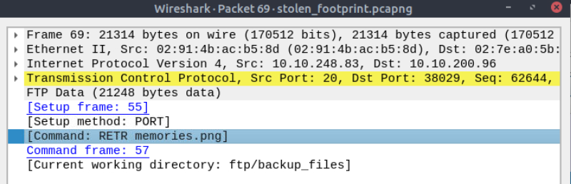

<div align="center">

# 🕵️ Stolen Footprints  
## Network Forensics & File Exfiltration Analysis


</div>

---

### 🎯 Objective

Investigate network traffic captured from a compromised system to determine what data was stolen.

The challenge description indicated that an attacker authenticated to a file server and retrieved a file. The objective was to analyze the captured network traffic and identify the file that was exfiltrated.

This required performing **network forensic analysis** using packet inspection techniques.

---

### 🖥 Environment

| Tool | Purpose |
|-----|------|
| Kali Linux AttackBox | Investigation environment |
| Wireshark | Packet capture analysis |
| TCP stream analysis | Extract transferred data |
| Manual packet inspection | Identify suspicious activity |

---

### 📦 Step 1 — Obtain the Network Capture

The investigation began by opening the provided `.pcapng` file in **Wireshark**.

Packet capture files record network activity and allow investigators to reconstruct events that occurred during a security incident.

The objective was to identify suspicious network activity associated with file transfers.

---

### 🔍 Step 2 — Identify File Transfer Activity

Because the challenge mentioned that the attacker accessed a file server, the investigation focused on identifying **FTP traffic**.

To locate file retrieval commands, the following Wireshark display filter was applied:

```
ftp.request.command == "RETR"
```

This filter isolates packets where an FTP client requests to retrieve a file from the server.

---

### 🧪 Step 3 — Locate the Retrieved File

Applying the filter revealed a request where the attacker retrieved a file named:

```
memories.png
```

📸 **FTP File Retrieval Identified**



This confirmed that the attacker downloaded a file from the server using the FTP `RETR` command.

---

#### 🔎 Analytical Observation

FTP traffic is transmitted in plaintext, meaning credentials and file commands can often be observed directly within packet captures.

This makes FTP investigations particularly useful in forensic analysis because investigators can reconstruct:

- usernames and passwords  
- files transferred  
- timestamps of activity  
- client-server communication  

---

### 🔄 Step 4 — Extract the Transferred File

After identifying the file retrieval command, the next step was to extract the transferred file from the TCP stream.

To reconstruct the file:

1. **Right-click the packet containing the `RETR memories.png` request**  
2. Select **Follow → TCP Stream**

Once the TCP stream window opened, the conversation between the client and server became visible.

In some streams, binary data appeared beginning with the PNG file signature:

```
89 50 4E 47 0D 0A 1A 0A
```

This sequence identifies the start of a PNG file.

If the correct stream was not visible immediately, additional streams were inspected until the binary data appeared.

After locating the correct stream:

- Change **Show Data As → Raw**
- Click **Save As**
- Save the reconstructed file as:

```
memories.png
```

This process allowed the file transferred by the attacker to be recovered from the packet capture.

---

### 🔐 Step 5 — Confirm File Recovery

After extracting the file from the TCP stream, it was opened for inspection.

📸 **Recovered Exfiltrated File**


The recovered image contained the information required to complete the challenge, confirming that the attacker had successfully exfiltrated this file from the server.

---

## 🧠 Methodology Framework Applied

```
Packet capture obtained
      ↓
Protocol analysis performed
      ↓
FTP retrieval command identified
      ↓
TCP stream reconstruction
      ↓
File extracted from network traffic
      ↓
Exfiltrated data recovered
```

---

## 🛠 Techniques Used

Primary techniques used:

- network packet inspection  
- FTP protocol analysis  
- TCP stream reconstruction  
- file extraction from packet capture  

Key concept investigated:

```
Network-based data exfiltration
```

---

## 🛡 Defensive Insight

Protocols such as FTP transmit data in plaintext, making them vulnerable to interception and analysis.

Attackers who gain access to a system may use such protocols to exfiltrate data.

Organizations should implement stronger security controls such as:

- replacing FTP with encrypted alternatives (SFTP/FTPS)  
- monitoring network traffic for suspicious transfers  
- implementing data loss prevention (DLP) solutions  
- restricting unauthorized file transfers  

Proper monitoring can help detect and prevent data exfiltration attempts.

---

## 💡 Skills Reinforced

- Network forensic investigation  
- Wireshark packet analysis  
- TCP stream reconstruction  
- FTP protocol inspection  
- Data exfiltration detection  

---

<div align="center">

🕵️ Packet captures reveal attacker activity  
🔍 TCP stream reconstruction exposes stolen files  
🧠 Network forensics helps uncover data exfiltration  

</div>
