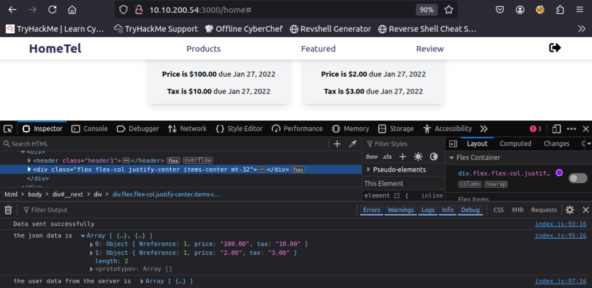
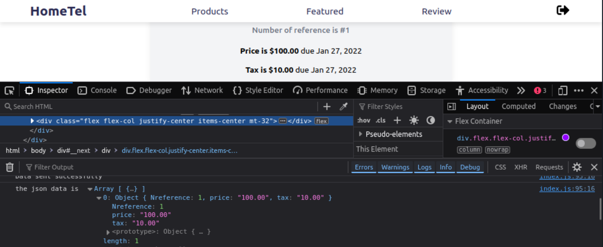
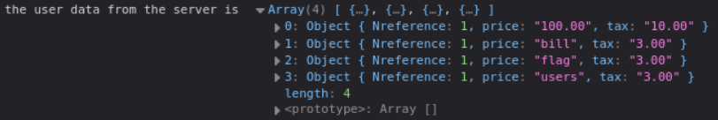
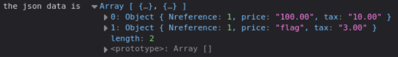
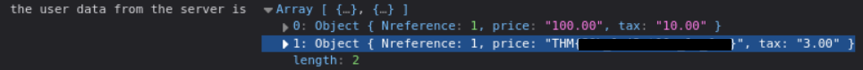

<div align="center">

# 🧬 The Sequel  
## SQL Injection & Database Enumeration Investigation


</div>

---

### 🎯 Objective

Investigate a web application suspected of being vulnerable to **SQL injection** due to improper handling of user-supplied input.

The challenge hinted that the application did not properly sanitize database queries.

The objective was to determine whether database queries could be manipulated to extract internal information from the backend database.

---

### 🖥 Environment

| Tool | Purpose |
|-----|------|
| Web browser | Application interaction |
| Kali Linux AttackBox | Testing environment |
| Browser input fields | Injection testing |
| SQL query manipulation | Database enumeration |

---

### 📦 Step 1 — Access the Target Application

After launching the challenge machine, the web application was accessed through the provided address.

```
http://10.10.x.x:3000
```

The application contained multiple pages including a **billing section**, which appeared to retrieve records from a backend database.

📸 **Application Billing Interface**



Because this page dynamically displayed database content, it became the primary candidate for SQL injection testing.

---

### 🔍 Step 2 — Test for SQL Injection

To determine whether the input field was vulnerable to SQL injection, a simple UNION query payload was inserted.

```sql
1 UNION SELECT 1,2,3
```

📸 **Initial Injection Test**



The server returned a modified response, confirming that user input was being inserted directly into a SQL query without proper sanitization.

This behavior confirmed the presence of a **SQL injection vulnerability**.

---

### 🧪 Step 3 — Enumerate Database Tables

Once SQL injection was confirmed, the next step was to identify the available database tables.

This was accomplished by querying the database metadata stored in the `information_schema` tables.

```sql
1 UNION SELECT 1,table_name,3 FROM information_schema.tables
```

📸 **Database Table Enumeration**



The response revealed the names of tables present in the database, allowing the investigation to identify tables likely to contain sensitive data.

---

### 🔄 Step 4 — Identify Table Columns

After identifying a table of interest, the next step was to enumerate the column names associated with that table.

```sql
1 UNION SELECT 1,GROUP_CONCAT(column_name),3
FROM information_schema.columns
WHERE table_name='flag'
```

📸 **Column Enumeration**



This query revealed the structure of the table storing the protected data.

---

### 🔐 Step 5 — Retrieve Sensitive Data

With the table structure identified, the final step was to retrieve the contents stored within the relevant column.

📸 **Database Data Retrieval**



The response confirmed that database records could be extracted directly through the injection point.

This demonstrated that the application allowed **full database enumeration and data extraction through SQL injection**.

---

## 🧠 Methodology Framework Applied

```
Web application access
      ↓
Input field testing
      ↓
SQL injection confirmation
      ↓
Database table enumeration
      ↓
Column discovery
      ↓
Sensitive data extraction
```

---

## 🛠 Techniques Used

Primary techniques used:

- SQL injection testing  
- UNION query manipulation  
- database schema enumeration  
- metadata extraction via `information_schema`

Key concept investigated:

```
SQL Injection
```

---

## 🛡 Defensive Insight

SQL injection vulnerabilities occur when applications construct database queries using unsanitized user input.

Secure development practices include:

- parameterized queries  
- prepared statements  
- strict input validation  
- least-privilege database permissions  

Proper query handling prevents attackers from manipulating database commands and extracting sensitive information.

---

## 💡 Skills Reinforced

- Web application vulnerability testing  
- SQL injection detection  
- Database enumeration techniques  
- Query manipulation and schema discovery  
- Secure database design awareness  

---

<div align="center">

🧬 Test how applications build database queries  
🔍 Enumerate database structure methodically  
🔐 SQL injection can expose entire databases  

</div>
