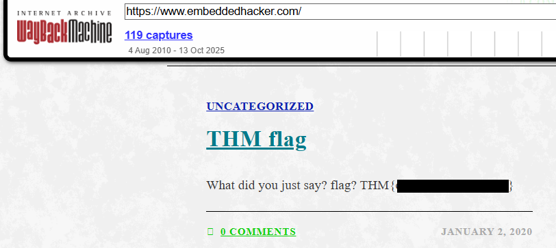

<div align="center">

# 🕰 Time Travel  
## Historical Web Analysis & OSINT Investigation


</div>

---

### 🎯 Objective

Investigate a website using historical archives to locate information that is no longer visible on the current version of the site.

The challenge suggested that the required information existed in a **previous version of the website**, requiring the use of historical web archives.

The goal was to use **open-source intelligence (OSINT) techniques** to retrieve content from a specific moment in time.

---

### 🖥 Environment

| Tool | Purpose |
|-----|------|
| Web browser | Investigation interface |
| Wayback Machine | Historical website archive |
| Internet access | OSINT research |

---

### 📦 Step 1 — Identify the Target Website

The challenge provided a specific website to investigate:

```
https://www.embeddedhacker.com
```

Additionally, the challenge specified that the information could be found on the site **as it appeared on January 2, 2020**.

This indicated that the investigation required accessing an archived version of the site rather than its current content.

---

### 🔍 Step 2 — Access the Wayback Machine

To retrieve historical versions of the website, the **Internet Archive Wayback Machine** was used.

The Wayback Machine allows investigators to view previously captured versions of websites at different points in time.

The target website was entered into the archive search interface.

---

### 🧪 Step 3 — Locate the Correct Snapshot

The archive timeline displayed multiple snapshots of the site across different dates.

Using the challenge hint, the investigation focused on the snapshot corresponding to:

```
January 2, 2020
```

Selecting this snapshot loaded the historical version of the website as it existed on that date.

---

#### 🔎 Analytical Observation

Historical archives are valuable for security investigations because they can reveal:

- previously exposed information
- removed content
- development artifacts
- sensitive data accidentally published

Even if a website owner removes sensitive information, **archived copies may still exist publicly**.

---

### 🔄 Step 4 — Inspect Archived Content

Once the correct snapshot was loaded, the archived version of the website was examined carefully.

The page contained embedded information that was not visible on the modern version of the site.

This confirmed that the information had existed publicly at one time but had later been removed.

---

### 🔐 Step 5 — Confirm Historical Data Exposure

The archived page revealed the hidden information required by the challenge.

📸 **Archived Website Snapshot**



This demonstrated how historical web archives can expose data that organizations believed had been permanently removed.

---

## 🧠 Methodology Framework Applied

```
Target website identification
      ↓
Historical archive search
      ↓
Snapshot timeline review
      ↓
Correct snapshot selection
      ↓
Archived page inspection
      ↓
Hidden information discovered
```

---

## 🛠 Techniques Used

Primary techniques used:

- open-source intelligence (OSINT)
- historical website analysis
- archived content inspection
- investigative research

Key concept investigated:

```
Historical web archives
```

---

## 🛡 Defensive Insight

Removing information from a website does not guarantee that the information disappears from the internet.

Public archiving systems may store previous versions of a website indefinitely.

Organizations should avoid publishing sensitive information publicly, even temporarily.

Recommended security practices include:

- reviewing content before publishing
- monitoring public archives
- requesting removal of sensitive archived material when necessary
- maintaining awareness of digital data permanence

---

## 💡 Skills Reinforced

- Open-source intelligence investigation  
- Historical website analysis  
- Research using archived internet resources  
- Identifying exposed historical information  

---

<div align="center">

🕰 The internet rarely forgets  
🔎 Archived content can reveal hidden data  
🌐 OSINT techniques uncover historical exposure  

</div>
