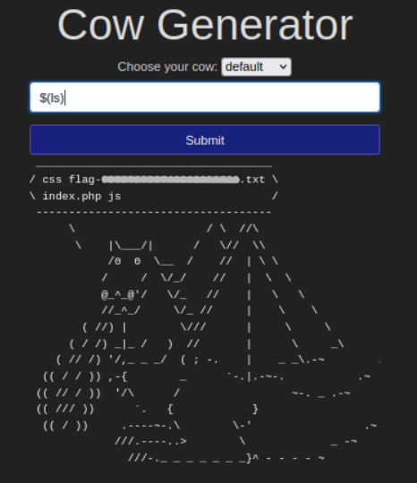
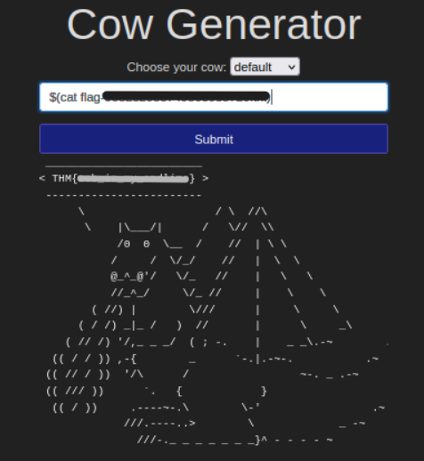

<div align="center">

# 🐄 What Does the Cow Say  
## Command Injection & Shell Interaction Analysis


</div>

---

### 🎯 Objective

Analyze a PHP web application and determine whether user input can influence the system commands executed by the server.

The challenge involved interacting with a simple web interface and identifying whether backend command execution could be manipulated through crafted input.

The goal was to determine if the application was vulnerable to **command injection**, allowing an attacker to execute arbitrary shell commands.

---

### 🖥 Environment

| Tool | Purpose |
|-----|------|
| Web Browser | Interaction with the target application |
| Kali Linux | Investigation environment |
| Basic Linux Commands | Directory enumeration and file inspection |
| Command Injection | Manipulating backend command execution |

---

### 📦 Step 1 — Access the Application

After starting the challenge machine, the target web application was accessed through the provided IP address.

```
http://10.10.x.x
```

The page contained a simple form that accepted user input and returned a response.

Given the nature of the challenge description, the next step was to determine whether the input field interacted with system commands on the backend.

---

### 🔍 Step 2 — Test Command Injection

To determine whether the input field was vulnerable to command injection, a command substitution payload was entered into the form:

```bash
$(ls)
```

If the application executed the input within a shell context, this command would return a directory listing.

📸 **Server Directory Listing**



The response revealed several server-side files:

```
css
flag-[redacted].txt
index.php
js
```

The presence of the flag file confirmed that **the application was executing user input as part of a shell command**.

---

### 🔄 Step 3 — Retrieve the Target File

After identifying the flag file from the directory listing, the next step was to read its contents.

The following command injection payload was submitted:

```bash
$(cat flag-[redacted].txt)
```

📸 **File Contents Retrieved**



The server executed the injected command and returned the contents of the file in the HTTP response, confirming that arbitrary commands could be executed through the vulnerable input field.

---

## 🧠 Methodology Framework Applied

```
Web application access
      ↓
Input field testing
      ↓
Command substitution payload
      ↓
Directory enumeration
      ↓
File discovery
      ↓
Command execution to retrieve contents
```

---

## 🛠 Commands Used

```bash
$(ls)
$(cat flag-[redacted].txt)
```

These payloads leveraged shell command substitution to execute system commands through the web application's backend.

---

## 🛡 Defensive Insight

Command injection vulnerabilities occur when applications execute user-supplied input within system commands without proper sanitization.

Secure development practices include:

- validating user input
- sanitizing special characters
- avoiding direct shell execution
- using parameterized command execution methods

Without proper input validation, attackers may execute arbitrary system commands and potentially gain full system access.

---

## 💡 Skills Reinforced

- Web application vulnerability analysis  
- Command injection detection  
- Server-side command execution behavior  
- Directory enumeration through shell commands  
- Input validation awareness  

---

<div align="center">

🐄 Never trust user input  
🔎 Test how applications process shell characters  
🧠 Command injection can expose entire systems  

</div>
